# AI-Powered Customer Support Triage Agent
## Product Requirements, Tech Stack, Architecture & Backend Schema

| Field | Value |
|---|---|
| **Document type** | PRD + Technical Design Specification |
| **Product codename** | **Triage** (working name) |
| **Source** | [Solution Proposal v1.0](./ai-powered-customer-support-triage-agent-solution-proposal.md) |
| **Version** | 1.0 — Draft for review |
| **Date** | October 2026 |
| **Owner** | Muhammad Ahsan |
| **Status** | Proposed |

---

## Table of Contents

**Part 0 — Proposal Analysis**
- [0. Proposal Analysis & Key Decisions](#0-proposal-analysis--key-decisions)

**Part A — Product Requirements Document (PRD)**
- [1. Product Overview](#1-product-overview)
- [2. Goals, Non-Goals & Success Criteria](#2-goals-non-goals--success-criteria)
- [3. Personas](#3-personas)
- [4. Core User Journeys](#4-core-user-journeys)
- [5. Functional Requirements](#5-functional-requirements)
- [6. Non-Functional Requirements](#6-non-functional-requirements)
- [7. Metrics & Instrumentation](#7-metrics--instrumentation)
- [8. Release Plan](#8-release-plan)
- [9. Assumptions, Dependencies, Risks & Open Questions](#9-assumptions-dependencies-risks--open-questions)

**Part B — Tech Stack**
- [10. Technology Stack](#10-technology-stack)
- [11. AI / ML Stack in Depth](#11-ai--ml-stack-in-depth)
- [12. Repository Structure](#12-repository-structure)

**Part C — Complete Architecture**
- [13. Architectural Principles](#13-architectural-principles)
- [14. System Context (C4 Level 1)](#14-system-context-c4-level-1)
- [15. Container Architecture (C4 Level 2)](#15-container-architecture-c4-level-2)
- [16. Service Catalog](#16-service-catalog)
- [17. The Triage Agent (Agent Graph Design)](#17-the-triage-agent-agent-graph-design)
- [18. Knowledge & RAG Pipeline](#18-knowledge--rag-pipeline)
- [19. Action Engine & Tool Framework](#19-action-engine--tool-framework)
- [20. Routing & Prioritization Engine](#20-routing--prioritization-engine)
- [21. Proactive Engine & Account Health](#21-proactive-engine--account-health)
- [22. Continuous Learning Loop (MLOps / LLMOps)](#22-continuous-learning-loop-mlops--llmops)
- [23. Event-Driven Backbone](#23-event-driven-backbone)
- [24. Multi-Tenancy & Data Isolation](#24-multi-tenancy--data-isolation)
- [25. Security & Compliance Architecture](#25-security--compliance-architecture)
- [26. Observability](#26-observability)
- [27. Deployment, Infrastructure & Disaster Recovery](#27-deployment-infrastructure--disaster-recovery)
- [28. Failure Modes & Graceful Degradation](#28-failure-modes--graceful-degradation)
- [29. Unit Economics & Cost Controls](#29-unit-economics--cost-controls)

**Part D — End-to-End Flows**
- [30. Flow Catalogue](#30-flow-catalogue)

**Part E — Backend Schema**
- [31. Data Model Overview (ERD)](#31-data-model-overview-erd)
- [32. PostgreSQL Schema (DDL)](#32-postgresql-schema-ddl)
- [33. Analytics Schema (ClickHouse)](#33-analytics-schema-clickhouse)
- [34. Event Schemas (Kafka)](#34-event-schemas-kafka)
- [35. Cache & Coordination (Redis)](#35-cache--coordination-redis)
- [36. API Surface](#36-api-surface)

**Appendices**
- [A. Starter Intent Taxonomy](#appendix-a--starter-intent-taxonomy)
- [B. Policy-as-Code Examples](#appendix-b--policy-as-code-examples)
- [C. Glossary](#appendix-c--glossary)

---

# Part 0 — Proposal Analysis

## 0. Proposal Analysis & Key Decisions

### 0.1 What the proposal asks for (distilled)

The proposal describes an **AI-native triage layer that sits in front of an existing helpdesk**. It does not replace Zendesk or Intercom. It intercepts every inbound inquiry, then:

1. **Understands** the inquiry: multi-label intent, confidence, entities, sentiment and urgency.
2. **Enriches** it with context from commerce, billing, CRM and knowledge systems.
3. **Resolves** Tier-1 inquiries on its own, by answering with RAG and by acting through tools (refunds, RMAs, password resets, order lookups).
4. **Routes and escalates** everything else, with a full context packet for the human agent.
5. **Reaches out proactively** on business events such as failed payments, abandoned carts and usage thresholds.
6. **Learns continuously** from resolved tickets and agent corrections.

It does this across e-commerce and SaaS verticals and many channels, with strict security, auditability and human-in-the-loop control.

### 0.2 Gaps, ambiguities & corrections

The proposal is a sales document. To turn it into an engineering specification, the following points need precise answers:

| # | Proposal statement | Issue | Resolution in this spec |
|---|---|---|---|
| 1 | "No hallucinations" (§10) | This cannot be guaranteed and can't be tested as written. | It becomes a measurable SLO: **groundedness ≥ 0.95** on the golden set, with an output guard that blocks ungrounded answers (§17.6). |
| 2 | "Model retrains on resolved tickets weekly" vs. "no customer data used to train shared base models" | These are only compatible if the trained artifacts are tenant-scoped. | Per-tenant **classifier heads and adapters**. Shared foundation LLMs are never fine-tuned on tenant data (§22). |
| 3 | "SOC 2 Type II compliant" | Type II needs an audit observation window of 3–12 months, so it can't be claimed at launch. | Controls are **SOC 2-ready by design** at GA. The Type II audit runs after the observation window (§25). |
| 4 | 12-week roadmap covering 7 channels, 4+ helpdesks and voice | This is unrealistic for one release. | Channels and integrations are phased: **MVP = Email + Web Chat + 1 helpdesk + Shopify/Stripe**. Voice comes in v2 (§8). |
| 5 | "Payback under 3 weeks" (SaaS) | This only holds at the low end. A $128K implementation against $142.5K/month savings pays back in about 3.9 weeks. | The sales collateral should say "**under 1 month**". |
| 6 | System of record is not defined | If both the helpdesk and the triage platform own ticket state, the data will diverge. | The **helpdesk owns the ticket lifecycle**, and Triage owns AI decisions, actions and audit. Sync is bidirectional and event-driven, with conflict rules (§19.6). |
| 7 | "Password resets" as autonomous resolution | This is an account-takeover vector if identity isn't verified. | **Identity assurance levels** gate every account-sensitive tool (§17.5). |
| 8 | Confidence thresholds are mentioned but not defined | The behaviour at a given confidence is ambiguous. | An explicit **decision matrix**, **autonomy levels L0–L3** and **calibrated confidence** (§17.4). |
| 9 | Multi-message bursts are not covered | Customers often send 3–4 short messages in a row, which can trigger duplicate triage runs. | **Message coalescing** with a debounce window and per-conversation locks (§17.2). |
| 10 | Prompt injection is not mentioned | Customer messages and KB content are untrusted inputs that reach tool-calling LLMs. | **Defense-in-depth** for injection and tool misuse (§25.4). |

### 0.3 Foundational design decisions

| Decision | Choice | Rationale |
|---|---|---|
| Agent runtime | **Deterministic state graph (LangGraph)**, not a free-form autonomous agent | Auditability, bounded behaviour, resumable human-approval interrupts |
| Classification | **Two-stage**: a fine-tuned encoder classifier first, then LLM adjudication only on low-confidence or ambiguous cases | Latency of about 30 ms vs. 1 s, LLM cost cut by roughly 70%, calibratable probabilities |
| Side-effecting actions | **Durable workflows (Temporal)** with idempotency keys and compensation | Refunds and RMAs must happen exactly once, survive crashes and wait days for approval |
| Data store | **PostgreSQL 18 + pgvector** with Row-Level Security | One transactional store for relational data and vectors, strong tenant isolation, simpler operations |
| Messaging | **Kafka with a transactional outbox** | Ordered per-conversation processing, replay, decoupled services |
| LLM access | **LLM gateway (LiteLLM)** with routing, fallbacks and budgets | Meets the "LLM-agnostic" requirement without code changes |
| Topology | **Modular monolith deployed as a few workloads, organised in bounded contexts** | Microservice boundaries without microservice overhead on day one. Contexts split out when scale requires it |
| Residency | **Cell-based regional deployment** (US / EU / APAC) | Data residency, blast-radius containment |

---

# Part A — Product Requirements Document (PRD)

## 1. Product Overview

### 1.1 Vision
> Every customer gets an accurate, policy-compliant answer in seconds, at any hour, in their language. Every human agent spends their time only on conversations that genuinely need human judgment.

### 1.2 Problem statement
E-commerce and SaaS support teams face ticket volumes that grow faster than headcount. Tier-1 inquiries take **60–70% of agent time**. Manual triage adds **15–45 minutes** of latency before the right person sees a ticket. Knowledge sits in disconnected systems. The results are slow first responses (12–24 h on average), high cost per ticket ($15–$25), agent burnout (30–45% attrition) and avoidable churn.

### 1.3 Product summary
**Triage** is a multi-tenant, omnichannel AI platform that:
- **Ingests** messages from email, chat, WhatsApp, in-app, social, voice and the API into one canonical conversation model.
- **Classifies** each message into a tenant-specific intent taxonomy, with calibrated confidence.
- **Extracts and verifies** entities such as order IDs, invoice IDs, SKUs and error codes against systems of record.
- **Scores** sentiment, urgency, churn risk and SLA risk.
- **Resolves** Tier-1 inquiries end-to-end using grounded RAG answers and governed tool actions.
- **Routes** the rest to the best-fit human, with a structured handoff packet.
- **Acts proactively** on business events.
- **Improves** every week from outcomes and human feedback.

### 1.4 Target market
| Segment | Profile | Primary value |
|---|---|---|
| **E-commerce (DTC / mid-market retail)** | 5K–100K tickets/month, Shopify / WooCommerce / Magento, seasonal peaks | WISMO deflection, returns automation, peak elasticity |
| **B2B SaaS (Series B → public)** | 3K–60K tickets/month, Stripe / Chargebee billing, developer audience | How-to deflection, billing automation, churn prevention, API support |

---

## 2. Goals, Non-Goals & Success Criteria

### 2.1 Goals
| ID | Goal | Measure |
|---|---|---|
| G1 | Cut First Response Time drastically | FRT P50 < 2 min by Month 6 (baseline 4–24 h) |
| G2 | Deflect Tier-1 volume autonomously | 50–65% autonomous resolution by Month 6 |
| G3 | Lower cost per ticket | $5–$8 by Month 6 (baseline $15–$25) |
| G4 | Maintain or raise quality | CSAT 88–93%; AI-resolved CSAT ≥ human-resolved CSAT |
| G5 | Route correctly the first time | Escalation/routing accuracy ≥ 95% |
| G6 | Be trustworthy | Groundedness ≥ 0.95; zero unauthorized side-effecting actions |
| G7 | Fast time-to-value | Shadow mode live in ≤ 4 weeks from kickoff; production in ≤ 12 weeks |

### 2.2 Non-goals (v1)
- **Replacing the helpdesk.** Triage complements Zendesk, Intercom and similar tools. It is not a ticketing system.
- **Building foundation models.** Triage orchestrates third-party and open-weight LLMs and fine-tunes only small task models.
- **Tier-2/3 technical troubleshooting** that needs access to production systems such as a customer's database or infrastructure.
- **Sales or marketing automation** beyond support-triggered proactive outreach.
- **Workforce management** (scheduling, forecasting). Triage consumes availability and does not plan it.
- **Voice/IVR in MVP or GA.** Voice is deferred to v2.

### 2.3 Release-level success criteria
| Gate | Criteria to pass |
|---|---|
| **Pilot exit (Week 8)** | Shadow-mode intent accuracy ≥ 90% (top-1) on live traffic; groundedness ≥ 0.95; routing accuracy ≥ 90%; zero P0 security findings |
| **GA (Week 12)** | ≥ 35% autonomous resolution on enabled intents; AI CSAT ≥ baseline − 2 pts; P95 chat first token < 1.5 s; 99.9% availability over 14 days |
| **Month 6** | Proposal KPI targets (§7 of proposal) met for ≥ 70% of tenants |

---

## 3. Personas

| Persona | Role | Goals | Pain points | Primary surface |
|---|---|---|---|---|
| **Maya — End Customer** | Shopper or SaaS user | Fast, correct answer; no repetition | Waiting hours; repeating context; bot loops | Chat widget, email, WhatsApp, in-app |
| **Jordan — Support Agent** | Tier-1/2 human agent | Clear context; fewer repetitive tickets | Copy-pasting from 5 tools; angry customers after a long wait | Helpdesk sidebar app, Triage inbox |
| **Priya — Support Manager / Team Lead** | Owns queues and SLAs | Hit SLAs; balanced workload; visibility | Unpredictable spikes; manual routing | Console: routing, SLA, live queue |
| **Alex — CX / Support Operations Admin** | Configures the system | Safe automation; fast iteration | Rigid bots; no control over AI behaviour | Console: taxonomy, policies, KB, autonomy |
| **Sam — Head of CX / VP Support** | Budget owner | ROI, CSAT, cost per ticket | Can't prove the value of tools | Executive dashboard, monthly reports |
| **Chris — Customer Success Manager (SaaS)** | Owns account retention | Early warning on at-risk accounts | Churn is visible only at renewal | Health alerts (Slack), account view |
| **Dev — Integration Engineer** | Client-side developer | Easy, well-documented integration | Poor APIs, no sandbox | REST API, webhooks, SDK, sandbox tenant |
| **Riley — Security / Compliance Officer** | Risk owner | Data control, auditability | AI black boxes; PII leakage | Audit log, DPA, data residency settings |

---

## 4. Core User Journeys

### J1 — Autonomous resolution (e-commerce WISMO)
> Maya writes in chat: *"Where's my order #48213? It was supposed to arrive yesterday."*
1. Triage classifies the message as `order.status` (0.97) with a secondary `shipping.delay` (0.81).
2. It extracts and verifies order `#48213` against Shopify and confirms the order belongs to the chat session's verified email.
3. It retrieves tracking from the carrier: delayed, new ETA tomorrow.
4. It composes a grounded answer with the tracking link and the delay policy, and offers to notify Maya on delivery.
5. It sends the reply in about 4 s. The conversation is auto-resolved and a CSAT survey follows.

### J2 — Multi-intent with partial autonomy and handoff
> *"I want a refund for the blue jacket AND my other order still hasn't shipped. This is ridiculous."*
1. Triage detects two intents: `refund.request` and `order.not_shipped`. Sentiment is strongly negative and urgency is 78 (P2).
2. It answers the shipping status itself.
3. The refund is worth $240, which exceeds the $150 auto-refund limit, so Triage raises an **approval request** and tells the customer the refund is under review.
4. A supervisor approves in Slack. The Temporal workflow executes the Stripe refund and Triage confirms with the customer.

### J3 — Escalation with full context
> A SaaS admin writes: *"Our SSO stopped working after your update, 200 users locked out."*
1. Triage classifies the message as `auth.sso_failure`. It detects an incident pattern (12 similar tickets in 30 minutes) and sets urgency to 95 (P1).
2. It does not attempt autonomous resolution because the intent is human-only. It routes to the Tier-2 Identity team and links the open incident.
3. The handoff packet holds the summary, account (Enterprise, $180K ARR, renewal in 41 days), attempted steps, related tickets and suggested runbook. It is posted to the helpdesk sidebar and the on-call Slack channel.

### J4 — Proactive outreach (SaaS failed payment)
1. A Stripe `invoice.payment_failed` webhook arrives. The proactive engine matches the "dunning-assist" trigger.
2. Suppression checks pass: no outreach in the last 7 days, not in quiet hours, account not in collections.
3. Triage sends an in-app message and an email with a secure update-payment link, then tracks conversion.

### J5 — Admin tunes autonomy safely
1. Alex reviews intent `returns.policy_question`. In shadow mode it shows 96% accuracy and 0.97 groundedness over 1,200 tickets.
2. Alex promotes the intent from **L1 (Assist)** to **L3 (Autonomous)** on the chat channel. The change is versioned and audited, and can be rolled back with one click.

### J6 — Agent correction feeds learning
1. Jordan receives a ticket routed as `billing.invoice_question` and re-tags it `billing.tax_exemption`.
2. The correction is captured as labelled feedback. The weekly training pipeline includes it, and the new classifier version is evaluated, then shadowed, then canaried, then promoted.

---

## 5. Functional Requirements

**Priority:** **P0** = MVP must-have · **P1** = GA · **P2** = post-GA (v1.5) · **P3** = v2
**Release:** MVP (Week 8 pilot) · GA (Week 12) · v1.5 · v2

### E1 — Omnichannel Ingestion
| ID | Requirement | Priority |
|---|---|---|
| FR-ING-01 | Ingest **email** via inbound parsing (MX/forwarding) and helpdesk sync, preserving threading (Message-ID / In-Reply-To) | P0 |
| FR-ING-02 | Provide an embeddable **web chat widget** (≤ 40 KB gzipped) with streaming responses, attachments, CSAT and accessibility (WCAG 2.2 AA) | P0 |
| FR-ING-03 | Ingest tickets and messages bidirectionally from **Zendesk** and **Intercom** | P0 |
| FR-ING-04 | Ingest **WhatsApp Business** via Twilio / Meta Cloud API, honouring the 24 h session window and templates | P1 |
| FR-ING-05 | Provide an **in-app SDK** (JS, iOS, Android) with authenticated user context (signed JWT) | P1 |
| FR-ING-06 | Connect **Freshdesk** and **Salesforce Service Cloud** | P1 / P2 |
| FR-ING-07 | Ingest **social DMs** (Instagram, Facebook Messenger, X) | P2 |
| FR-ING-08 | Ingest **Slack / Microsoft Teams** for internal and B2B shared-channel support | P2 |
| FR-ING-09 | Handle **voice / IVR** with streaming STT/TTS, barge-in and warm transfer to an agent | P3 |
| FR-ING-10 | Normalize every input to a **canonical message model**, deduplicate by idempotency key, and coalesce bursts within a configurable debounce window (default 4 s chat, 0 s email) | P0 |
| FR-ING-11 | Resolve **customer identity** across channels (email, phone, external IDs) into a single customer profile | P0 |
| FR-ING-12 | Scan attachments for malware, extract text (PDF, images via OCR) and make them available to triage | P1 |

### E2 — Intent Classification
| ID | Requirement | Priority |
|---|---|---|
| FR-CLS-01 | Classify each message into a **hierarchical, tenant-specific intent taxonomy** (≤ 4 levels) | P0 |
| FR-CLS-02 | Support **multi-label** output: zero or more intents per message, each with a calibrated confidence in [0,1] | P0 |
| FR-CLS-03 | Produce **calibrated** confidences (ECE ≤ 0.05 on holdout) so that thresholds mean what they say | P0 |
| FR-CLS-04 | Provide an **out-of-taxonomy / novel intent** detector that routes to a human and feeds gap analysis | P1 |
| FR-CLS-05 | Bootstrap a taxonomy from 12–24 months of historical tickets (clustering plus LLM labelling plus admin review) | P0 |
| FR-CLS-06 | Classify across **30+ languages** without per-language models | P1 |
| FR-CLS-07 | Admins can create, merge, split and deprecate intents with versioning; historical labels are migrated | P1 |

### E3 — Entity Extraction & Context Enrichment
| ID | Requirement | Priority |
|---|---|---|
| FR-ENT-01 | Extract typed entities (order_id, tracking_no, sku, email, invoice_id, subscription_id, plan, error_code, amount, date) with spans and confidence | P0 |
| FR-ENT-02 | **Verify** entities against systems of record and ownership (for example, that the order belongs to this customer) before any use | P0 |
| FR-ENT-03 | Enrich the context with customer profile, LTV, plan or tier, open orders and subscriptions, recent tickets, and account health | P0 |
| FR-ENT-04 | When required entities are missing, ask a **clarifying question** (max 2 turns before routing to a human) | P0 |

### E4 — Sentiment, Urgency & Prioritization Signals
| ID | Requirement | Priority |
|---|---|---|
| FR-URG-01 | Score sentiment (−1..1) and emotion flags (frustration, anger, confusion) per message and conversation trend | P0 |
| FR-URG-02 | Compute an **urgency score (0–100)** from sentiment, churn signals, SLA risk, revenue impact, intent priority and repeat contact. Weights are configurable per tenant | P0 |
| FR-URG-03 | Detect **hard-escalation triggers**: legal threats, chargebacks, safety, data breach claims, executive mentions, regulators | P0 |
| FR-URG-04 | Detect **incident clusters** (spike of semantically similar tickets) and link them to an incident | P1 |

### E5 — Knowledge & RAG
| ID | Requirement | Priority |
|---|---|---|
| FR-KB-01 | Connect knowledge sources: Zendesk Guide, Intercom Articles, Confluence, Notion, Google Drive, websites, file upload, OpenAPI specs, past resolved tickets | P0 (first 3) / P1 |
| FR-KB-02 | Run incremental sync (change detection by content hash) with per-source schedule, and support manual re-sync | P0 |
| FR-KB-03 | Use **structure-aware chunking** (headings, tables, code blocks) with metadata (audience, product, locale, version, effective date) | P0 |
| FR-KB-04 | Use **hybrid retrieval** (dense plus lexical), reciprocal rank fusion and cross-encoder reranking, with metadata filters (audience=public for customer answers) | P0 |
| FR-KB-05 | Every customer-facing answer carries **citations** to the source chunks | P0 |
| FR-KB-06 | Internal-only content (macros, internal wiki) is **never** quoted to customers and is used only for agent assist | P0 |
| FR-KB-07 | **Knowledge gap analysis** clusters unanswered or low-retrieval-score questions and suggests new articles | P1 |
| FR-KB-08 | Detect stale or conflicting content (contradictions between articles) | P2 |

### E6 — Autonomous Resolution & Actions
| ID | Requirement | Priority |
|---|---|---|
| FR-ACT-01 | Provide a **tool registry** with typed input/output schemas (JSON Schema), risk tier and required identity assurance level | P0 |
| FR-ACT-02 | E-commerce tools: order lookup, tracking lookup, return/RMA creation, return label generation, refund (full/partial), cancel order, address change (pre-fulfilment), restock alert subscription, discount code validation | P0 (read) / P1 (write) |
| FR-ACT-03 | SaaS tools: password reset link, account unlock, MFA reset request (approval), plan/quota lookup, invoice retrieval, proration preview, plan change, API key regeneration guidance, status-page lookup | P0 (read) / P1 (write) |
| FR-ACT-04 | All side-effecting actions are executed **exactly once** (idempotency key per conversation+action+args), are **durable**, and support **compensation** | P0 |
| FR-ACT-05 | **Approval gates**: configurable by action, amount threshold, customer tier, and risk. Approvals are possible in the console, Slack or Teams, with expiry and escalation | P1 |
| FR-ACT-06 | **Dry-run** mode for every write tool, used in shadow and assist modes | P0 |
| FR-ACT-07 | Per-tenant **custom tools** via HTTP/OpenAPI definitions or MCP servers (sandboxed, allow-listed) | P2 |

### E7 — Routing & Prioritization
| ID | Requirement | Priority |
|---|---|---|
| FR-RTE-01 | **Skill-based routing** on skills, language, team, availability and capacity | P0 |
| FR-RTE-02 | Queue ordering by priority, then SLA due time (earliest-deadline-first) | P0 |
| FR-RTE-03 | Rule-based overrides (VIP to a dedicated team, enterprise accounts to a named CSM) | P0 |
| FR-RTE-04 | **SLA policies** per priority, segment and channel, with business hours, breach prediction and alerts | P1 |
| FR-RTE-05 | Write routing results back to the helpdesk (group, assignee, tags, priority, custom fields) | P0 |
| FR-RTE-06 | Load-aware rebalancing and stale-assignment reclaim (unaccepted after N min) | P1 |

### E8 — Human Handoff & Agent Assist
| ID | Requirement | Priority |
|---|---|---|
| FR-HND-01 | Generate a **handoff packet** on every escalation: TL;DR summary, intents, sentiment trend, customer and account context, verified entities, actions attempted and their results, suggested next steps, KB links | P0 |
| FR-HND-02 | Provide a **helpdesk sidebar app** (Zendesk Apps Framework, Intercom Canvas Kit) showing the packet, drafts and one-click actions | P0 |
| FR-HND-03 | Provide **AI reply drafts** for agents with citations; record whether each draft was sent as-is, edited or discarded (edit distance) | P0 |
| FR-HND-04 | Customer-facing **seamless transition** message with expected wait time; the customer never has to repeat themselves | P0 |
| FR-HND-05 | Agents can hand a conversation **back** to the AI (for example, after verifying identity) | P2 |

### E9 — Proactive Support
| ID | Requirement | Priority |
|---|---|---|
| FR-PRO-01 | Event-triggered outreach: payment failed, cart abandoned, shipment delayed, usage threshold reached, adoption stall, frustration pattern | P2 |
| FR-PRO-02 | Suppression: frequency caps, cooldowns, quiet hours (customer timezone), consent and opt-out, open-ticket suppression | P2 |
| FR-PRO-03 | Attribution: conversion tracking (payment updated, cart recovered) | P2 |

### E10 — Account Health (SaaS)
| ID | Requirement | Priority |
|---|---|---|
| FR-HLT-01 | Compute a daily **account health score** from product usage, support friction, sentiment, billing state and renewal proximity | P2 |
| FR-HLT-02 | Flag at-risk accounts to CSMs (Slack or CRM task) with an explanation (top contributing factors) and recommended action | P2 |

### E11 — Policy, Autonomy & Guardrails
| ID | Requirement | Priority |
|---|---|---|
| FR-POL-01 | **Autonomy levels L0–L3** configurable per intent × channel × customer segment | P0 |
| FR-POL-02 | Confidence thresholds per intent (auto, draft, route) with simulation ("what would have happened last 30 days") | P1 |
| FR-POL-03 | **Policy-as-code** (OPA/Rego) for approval rules, refund limits, eligibility and tone constraints, versioned and testable | P1 |
| FR-POL-04 | Output guardrails: groundedness check, policy-compliance check, PII-leak check, toxicity, brand tone, promise detection ("we will refund" without an executed action) | P0 |
| FR-POL-05 | **Kill switch**: instantly drop a tenant, channel or intent to L0/L1 | P0 |

### E12 — Learning & Feedback
| ID | Requirement | Priority |
|---|---|---|
| FR-LRN-01 | Capture feedback signals: intent corrections, routing corrections, draft edits, CSAT, reopen events, escalations after AI resolution | P0 |
| FR-LRN-02 | **Weekly retraining** of tenant classifiers with evaluation gates, shadow and canary promotion, and one-click rollback | P1 |
| FR-LRN-03 | Nightly RAG and response quality evaluation on golden datasets, with regression alerts | P1 |
| FR-LRN-04 | Active learning: route low-confidence samples to a labelling queue in the console | P2 |

### E13 — Analytics & Reporting
| ID | Requirement | Priority |
|---|---|---|
| FR-ANL-01 | Live dashboard: volume, FRT, resolution time, deflection, escalation rate, CSAT, backlog, SLA attainment by channel, intent and team | P0 |
| FR-ANL-02 | AI quality dashboard: intent accuracy, confidence distribution, groundedness, draft acceptance, cost per ticket | P1 |
| FR-ANL-03 | ROI report: cost per ticket vs. baseline, hours saved, savings. Monthly PDF export | P1 |
| FR-ANL-04 | Conversation explorer: full trace of each AI decision (inputs, retrieved docs, tool calls, policy evaluations) | P0 |
| FR-ANL-05 | Data export to the customer warehouse (Snowflake, BigQuery) via scheduled export or streaming | P2 |

### E14 — Administration, Security & Compliance
| ID | Requirement | Priority |
|---|---|---|
| FR-ADM-01 | SSO (SAML/OIDC), SCIM provisioning, MFA enforcement | P0 (SSO) / P1 |
| FR-ADM-02 | RBAC roles: Owner, Admin, Supervisor, Agent, Analyst, Developer, Auditor, plus custom roles | P0 |
| FR-ADM-03 | Immutable, tamper-evident **audit log** of every AI decision, action, approval and config change | P0 |
| FR-ADM-04 | PII detection and redaction in logs, analytics and training data; reversible pseudonymization for LLM calls | P0 |
| FR-ADM-05 | Data residency selection (US, EU, APAC) at tenant creation | P1 (US/EU) / P2 (APAC) |
| FR-ADM-06 | Data retention policies, DSAR export and right-to-erasure workflows (GDPR/CCPA) | P1 |
| FR-ADM-07 | Sandbox tenant with seeded data and dry-run tools | P1 |

### E15 — Developer Platform
| ID | Requirement | Priority |
|---|---|---|
| FR-DEV-01 | Public REST API (OpenAPI 3.1) for conversations, messages, customers, KB and analytics | P1 |
| FR-DEV-02 | Signed outbound **webhooks** (HMAC-SHA256, retries with backoff, replay) | P1 |
| FR-DEV-03 | Scoped API keys with rotation; per-key rate limits | P1 |
| FR-DEV-04 | Expose Triage as an **MCP server** so client-side AI agents can query KB and ticket status | P3 |

---

## 6. Non-Functional Requirements

### 6.1 Performance
| ID | Requirement | Target |
|---|---|---|
| NFR-PERF-01 | Chat: time to first streamed token | P95 ≤ 1.5 s |
| NFR-PERF-02 | Chat: full AI response (read-only intents) | P95 ≤ 6 s |
| NFR-PERF-03 | Email/async: inbound to helpdesk routed/answered | P95 ≤ 60 s |
| NFR-PERF-04 | Stage-1 intent classification | P95 ≤ 50 ms |
| NFR-PERF-05 | Hybrid retrieval plus rerank | P95 ≤ 400 ms |
| NFR-PERF-06 | Console page load (dashboard) | P95 ≤ 2 s (LCP) |

### 6.2 Scalability
| ID | Requirement | Target |
|---|---|---|
| NFR-SCL-01 | Sustained throughput per regional cell | 200 inbound msgs/s |
| NFR-SCL-02 | Burst absorption (flash sale, incident) | 10× tenant baseline for 2 h without SLO breach, via queue buffering plus KEDA autoscaling |
| NFR-SCL-03 | Tenants per cell | ≥ 500 |
| NFR-SCL-04 | Knowledge base size per tenant | ≥ 5M chunks |

### 6.3 Availability & resilience
| ID | Requirement | Target |
|---|---|---|
| NFR-AVL-01 | API and ingestion availability | 99.9% (Enterprise: 99.95%) monthly |
| NFR-AVL-02 | No message loss | Inbound messages durably acknowledged before 2xx response; DLQ for poison messages |
| NFR-AVL-03 | LLM provider outage | Automatic failover to a secondary provider in ≤ 30 s; if all providers fail, route to humans (never drop) |
| NFR-AVL-04 | RPO / RTO | RPO ≤ 5 min · RTO ≤ 1 h (regional failure) |

### 6.4 Security & privacy
| ID | Requirement |
|---|---|
| NFR-SEC-01 | TLS 1.3 in transit; AES-256 at rest; per-tenant data keys (envelope encryption, AWS KMS); Enterprise BYOK |
| NFR-SEC-02 | Tenant isolation enforced at the database layer (RLS), not only in application code |
| NFR-SEC-03 | No tenant data used to train shared foundation models; zero-data-retention agreements with LLM providers |
| NFR-SEC-04 | OWASP ASVS L2 and OWASP Top 10 for LLM Applications addressed; annual penetration test |
| NFR-SEC-05 | Secrets never in code or env files; short-lived credentials via IRSA / Workload Identity |

### 6.5 Quality of AI
| ID | Metric | Target |
|---|---|---|
| NFR-AI-01 | Intent top-1 accuracy (enabled intents) | ≥ 92% at GA; ≥ 95% at Month 6 |
| NFR-AI-02 | Expected Calibration Error | ≤ 0.05 |
| NFR-AI-03 | Groundedness (faithfulness) of sent answers | ≥ 0.95 |
| NFR-AI-04 | Answer relevance (LLM-judge plus human audit sample) | ≥ 0.90 |
| NFR-AI-05 | Harmful or policy-violating responses sent | 0 (blocking guard) |
| NFR-AI-06 | False auto-resolution (reopened in 72 h for the same issue) | ≤ 5% |

### 6.6 Other
- **Accessibility:** WCAG 2.2 AA for the widget and console.
- **Internationalization:** Console in English at GA. Customer-facing responses in 30+ languages.
- **Maintainability:** ≥ 80% unit test coverage on core domain modules; all prompts and policies versioned and code-reviewed.
- **Portability:** Infrastructure as code (Terraform). Single-tenant VPC deployment is possible for Enterprise.

---

## 7. Metrics & Instrumentation

### 7.1 North-star metric
**Resolved Conversations per Dollar**: conversations resolved to the customer's satisfaction (no reopen within 72 h, CSAT ≥ 4 or no negative signal) divided by total support cost. It combines efficiency (G2, G3) with quality (G4).

### 7.2 KPI definitions
| KPI | Formula | Source |
|---|---|---|
| **First Response Time (FRT)** | `first_response_at − created_at` (business hours optional) | `conversations` |
| **Autonomous Resolution Rate** | `count(resolution_type='ai_autonomous' AND NOT reopened_72h) / count(all resolved)` | `conversations` |
| **Deflection Rate** | `(ai_autonomous + self_serve_kb_success) / total_inbound` | ClickHouse |
| **Escalation Accuracy** | `1 − (re-routed by human within 30 min / total routed)` | `assignments` |
| **Draft Acceptance** | `(sent_as_is + edited with edit_ratio < 0.2) / drafts shown` | `response_drafts` |
| **Cost per Ticket** | `(LLM + infra + human labor allocation) / tickets` | ClickHouse plus tenant labor config |
| **Groundedness** | Mean faithfulness score of sent AI answers | `triage_runs.guard_scores` |
| **False Auto-Resolution** | `reopened within 72h for same intent / ai_autonomous` | `conversations` |
| **CSAT** | `% responses with rating ≥ 4/5`, split AI vs. human | `conversations.csat_score` |

### 7.3 Event instrumentation
Every state transition emits a domain event (see §34). These feed **ClickHouse** for analytics and **Langfuse** for LLM traces. The two are joined on `trace_id`.

---

## 8. Release Plan

This plan maps onto the proposal's implementation roadmap.

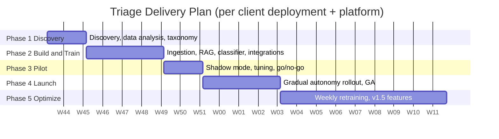

| Release | Timing | Scope |
|---|---|---|
| **MVP / Pilot** | Weeks 1–8 | Email + Web Chat · Zendesk **or** Intercom · Shopify + Stripe (read tools, dry-run write tools) · top 15–20 intents · RAG over help centre · **L0 Shadow + L1 Assist** · handoff packet + sidebar app · core dashboard · audit log · SSO · EN + 5 languages |
| **GA v1.0** | Weeks 9–12 | WhatsApp · in-app SDK (JS) · **L2/L3 autonomy** for low-risk intents · write tools with approvals (Slack) · SLA engine · weekly retraining with gates · policy-as-code · Freshdesk · 30+ languages · EU region · public API + webhooks |
| **v1.5** | +3 months | Proactive engine · account health scoring · Salesforce Service Cloud · Slack/Teams channels · social DMs · knowledge gap analysis · active learning · warehouse export · APAC region |
| **v2.0** | +6 months | Voice/IVR (streaming STT/TTS) · custom tools via OpenAPI/MCP · Tier-1 technical diagnostics (log/config analysis) · self-hosted open-weight model option · single-tenant VPC deployment · MCP server |

**Rollout strategy within a tenant:** shadow mode first on all intents. Then promote individual intents (L1, then L2, then L3), lowest-risk first (policy Q&A, then order status, then returns, then refunds). Promotion requires meeting each intent's gate: accuracy ≥ 95%, groundedness ≥ 0.95, ≥ 200 shadow samples, and admin sign-off.

---

## 9. Assumptions, Dependencies, Risks & Open Questions

### 9.1 Assumptions
- Clients can provide 12–24 months of historical tickets (≥ 10K) via helpdesk API export.
- Clients grant API scopes for helpdesk, commerce and billing systems (read plus write for enabled actions).
- Help-centre content exists and is reasonably current. If it isn't, KB remediation is a pre-requisite workstream.
- LLM providers offer zero-data-retention terms and regional endpoints (US/EU).

### 9.2 Dependencies
| Dependency | Type | Mitigation |
|---|---|---|
| LLM providers (Anthropic, OpenAI, Google) | External API | Multi-provider gateway; open-weight fallback |
| Helpdesk APIs (rate limits) | External API | Adaptive rate limiting, batching, webhook-first sync |
| Shopify / Stripe / carrier APIs | External API | Circuit breakers, short-TTL caches, graceful "I've escalated this" fallback |
| Twilio / Meta (WhatsApp) | External API | Template pre-approval lead time (1–3 days) in plan |

### 9.3 Risk register
| Risk | Likelihood | Impact | Mitigation |
|---|---|---|---|
| Hallucinated policy or promise reaches a customer | Med | High | Grounding guard, promise detector, citations required, L-level gating, sampling audits |
| Account takeover via social engineering of the AI (password/email change) | Med | Critical | Identity assurance levels; sensitive tools require IAL2+; never change contact email via AI |
| Prompt injection via customer message or KB content triggers a tool | Med | High | Tool allow-list per playbook, argument binding to verified entities, injection classifier, least privilege |
| Duplicate refunds or actions | Low | High | Temporal workflows plus idempotency keys plus provider idempotency headers |
| Low-quality or stale KB leads to poor deflection | High | Med | Discovery-phase KB audit, gap analysis, staleness detection |
| Helpdesk API rate limits during peak | Med | Med | Webhook ingestion, write coalescing, per-tenant token buckets |
| LLM cost overrun | Med | Med | Classifier-first, model tiering, prompt caching, semantic cache, per-tenant budgets and alerts |
| Agent and team resistance ("AI will replace us") | Med | Med | Position as copilot; draft acceptance metrics; involve agents in shadow review |
| Regulatory change (EU AI Act transparency) | Med | Med | AI disclosure in the widget ("You're chatting with an AI assistant"), human handoff always available, decision logging |

### 9.4 Open questions
1. Does each client's helpdesk remain the agent's primary workspace, or do some clients want a standalone Triage inbox? (This spec assumes the helpdesk is primary and the Triage inbox is secondary.)
2. Pricing unit: does a "ticket" mean a conversation or an inbound message? (Recommendation: a **conversation** with ≥ 1 inbound message per 7-day window.)
3. Do any clients need HIPAA at launch? This determines whether a BAA with LLM providers is needed at GA.
4. Who approves high-value actions outside business hours: queue until morning, or route to on-call?

---

# Part B — Tech Stack

## 10. Technology Stack

### 10.1 Stack at a glance

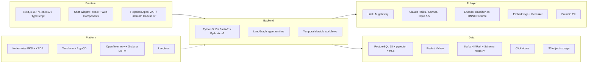

### 10.2 Layer-by-layer selection

#### Frontend
| Concern | Choice | Why | Alternatives considered |
|---|---|---|---|
| Console framework | **Next.js 15+ (App Router, RSC)**, **React 19**, **TypeScript 5 (strict)** | Server components for data-heavy dashboards, streaming, a mature ecosystem | Remix, SvelteKit |
| UI system | **Tailwind CSS v4** + **shadcn/ui** (Radix primitives) | Accessible primitives, design-token theming, no runtime CSS cost | MUI, Chakra |
| Server state | **TanStack Query v5** | Cache, optimistic updates, background refetch | SWR |
| Client state | **Zustand** | Minimal, ergonomic | Redux Toolkit |
| Forms & validation | **React Hook Form** + **Zod** (schemas generated from OpenAPI) | End-to-end type safety | Formik |
| Tables & virtualization | **TanStack Table** + **TanStack Virtual** | Large queues and conversation lists | AG Grid |
| Charts | **Recharts** / **Apache ECharts** | Interactive analytics | Nivo, Visx |
| Realtime | **Server-Sent Events** for token streaming; **WebSocket (Centrifugo)** for live queues and presence | SSE is simpler for one-way streaming; Centrifugo scales pub/sub fan-out | Socket.IO, Pusher |
| Policy & prompt editors | **Monaco Editor** | Rego, YAML and prompt editing with syntax highlighting | CodeMirror 6 |
| Chat widget | **Preact + Web Components (Shadow DOM)**, built with **Vite** | ≤ 40 KB, style isolation, framework-agnostic embed | Lit |
| Helpdesk sidebar | **Zendesk Apps Framework v2**, **Intercom Canvas Kit**, **Salesforce LWC** | Agents stay in their native tool | — |
| API client | **openapi-typescript** + **openapi-fetch** | Typed client generated from the backend OpenAPI | tRPC (no: polyglot backend) |
| Testing | **Vitest**, **Testing Library**, **Playwright** (E2E plus visual), **axe-core** (a11y) | — | Jest, Cypress |

#### Backend core
| Concern | Choice | Why |
|---|---|---|
| Language | **Python 3.13** (typed, `mypy --strict`) | The AI/ML ecosystem is first-class; one language across services and ML |
| API framework | **FastAPI** + **Pydantic v2** + **Uvicorn/Granian** | Async, OpenAPI 3.1 generation, high performance |
| ORM / DB access | **SQLAlchemy 2.0 (async)** + **asyncpg**; **Alembic** migrations | Mature, typed, explicit transactions |
| Agent orchestration | **LangGraph** (with Postgres checkpointer) | Deterministic state graph, interrupts for human-in-loop, resumable runs, time-travel debugging |
| Durable workflows | **Temporal** (Temporal Cloud or self-hosted) | Exactly-once business actions, long waits for approvals, retries, sagas, schedules |
| Data & ML pipelines | **Dagster** | Asset-based lineage for training data, KB ingestion and evals |
| Background tasks (light) | Temporal activities (no Celery) | One durable execution model |
| Event streaming | **Apache Kafka 4 (KRaft)** on **Amazon MSK** or Confluent Cloud; **Confluent Schema Registry** (Protobuf) | Ordered partitions, replay, schema evolution |
| CDC / outbox relay | **Debezium** (Postgres logical replication to Kafka) | Transactional outbox without dual writes |
| Policy engine | **Open Policy Agent (OPA)** with **Rego** (sidecar or embedded WASM) | Declarative, testable, auditable authorization and business rules |
| Integration auth | **Nango** (self-hosted) for OAuth token management across 250+ APIs | Unified OAuth refresh, connection health |
| HTTP resilience | **httpx** + **tenacity** + **aiobreaker** (circuit breaker) | Retries, timeouts, breakers per integration |
| Feature flags | **OpenFeature** SDK + **Unleash** | Progressive rollout of autonomy and models |
| Validation of LLM output | **Pydantic** structured outputs (tool/JSON schema mode) + **instructor**-style retries | Typed, validated LLM responses |
| Testing | **pytest**, **pytest-asyncio**, **Testcontainers**, **Hypothesis**, **Schemathesis** (API fuzzing), **Pact** (consumer contracts) | — |
| Load testing | **k6** | Black-Friday scenarios |
| Packaging | **uv** workspaces, **Ruff** (lint + format) | Fast, reproducible |

#### Data layer
| Store | Technology | Purpose |
|---|---|---|
| OLTP + vectors | **PostgreSQL 18** (Amazon RDS / Aurora) + **pgvector** (HNSW, `halfvec`) + `pg_trgm`, `ltree`, `citext` | Tenants, conversations, triage results, KB chunks and embeddings, policies, actions |
| Scale path for OLTP | **Citus** (distributed by `tenant_id`) | Horizontal scale; schema already uses tenant-leading composite keys |
| Scale path for vectors | **Qdrant** (multi-tenant collections) | If a tenant exceeds ~20M chunks |
| Cache / locks / rate limits | **Valkey/Redis 8** (ElastiCache) | Idempotency, conversation locks, token buckets, presence, semantic cache |
| Analytics | **ClickHouse** (ClickHouse Cloud) | Sub-second dashboards over billions of events |
| Objects | **Amazon S3** (SSE-KMS, Object Lock for audit exports) | Raw emails, attachments, KB source files, model artifacts |
| Secrets | **AWS Secrets Manager** + **External Secrets Operator** | Integration credentials, signing keys |
| Keys | **AWS KMS** (per-tenant data keys; BYOK for Enterprise) | Envelope encryption |

#### Channel providers
| Channel | Provider |
|---|---|
| Email | **AWS SES inbound** / **Postmark Inbound** + helpdesk email sync |
| WhatsApp | **Meta WhatsApp Cloud API** (direct) or **Twilio** |
| SMS | **Twilio** |
| Social DMs | **Meta Graph API** (Messenger, Instagram), **X API** |
| Slack / Teams | **Slack Bolt (Python)**, **Microsoft Bot Framework / Graph** |
| Voice (v2) | **LiveKit Agents** + **Twilio SIP**; STT **Deepgram**; TTS **Cartesia** or **ElevenLabs** |

#### Identity & access
| Concern | Choice |
|---|---|
| Workforce SSO, SCIM, directory sync | **WorkOS** (SAML/OIDC, SCIM, audit-log streaming) |
| Session / tokens | OIDC; short-lived JWT access tokens (15 min) + rotating refresh tokens |
| End-customer identity (in-app) | Tenant-signed **JWT (ES256)** passed to the widget/SDK |
| Service-to-service | mTLS (**Linkerd**) + SPIFFE identities; IRSA for AWS APIs |
| Authorization | RBAC in-app + **OPA** for fine-grained and ABAC rules + **Postgres RLS** for tenancy |

#### Platform, DevOps & SRE
| Concern | Choice |
|---|---|
| Cloud | **AWS** primary (us-east-1, eu-central-1, ap-southeast-1); cloud-agnostic via Kubernetes and Terraform |
| Orchestration | **Amazon EKS**, **Karpenter** (node autoscaling), **KEDA** (Kafka-lag and queue-depth pod autoscaling) |
| Ingress / edge | **Cloudflare** (WAF, DDoS, bot management, CDN for widget) → **AWS ALB** → **Envoy Gateway** (Kubernetes Gateway API) |
| Service mesh | **Linkerd** (mTLS, retries, golden metrics) |
| IaC | **Terraform** + **Terragrunt** (multi-cell) |
| GitOps / CD | **ArgoCD** + **Argo Rollouts** (canary with automated analysis) |
| CI | **GitHub Actions** (build, test, eval gates), **Turborepo** remote cache |
| Supply chain | **Trivy** (images, IaC), **Semgrep** (SAST), **Gitleaks**, **Renovate**, **Cosign** image signing, **SLSA L3** provenance, SBOM via **Syft** |
| Observability | **OpenTelemetry** SDKs → **Grafana Alloy** → **Mimir** (metrics), **Loki** (logs), **Tempo** (traces), **Grafana** dashboards; **Sentry** (errors, frontend RUM) |
| LLM observability | **Langfuse** (self-hosted): traces, prompt versioning, eval datasets, cost |
| On-call | **PagerDuty** / Grafana OnCall; SLO burn-rate alerts via **Sloth** |

---

## 11. AI / ML Stack in Depth

### 11.1 Model portfolio and routing

All LLM calls go through the **LiteLLM gateway**. The gateway handles provider abstraction, fallbacks, retries, per-tenant budgets, rate limits and cost logging, and caching.

| Task | Primary model | Fallback | Why |
|---|---|---|---|
| Intent adjudication (stage 2), entity extraction, language detection fallback, summarisation of short threads | **Claude Haiku 5.5** | Equivalent small model from a second provider | Fast, cheap, strong structured output |
| Customer response composition, multi-intent planning, tool-use reasoning | **Claude Sonnet 5.5** | Equivalent frontier model from a second provider | Best trade-off of quality, latency and tool use |
| Offline: LLM-as-judge evals, taxonomy bootstrapping, hard-case labelling, KB conflict detection | **Claude Opus 5.5** | — | Highest reasoning quality; not latency-sensitive |
| Data-residency or air-gapped Enterprise (v2) | Open-weight instruct model served on **vLLM** (GPU node pool) | — | No data leaves the client VPC |

**Optimisations**
- **Prompt caching** on static prefixes (system prompt, policies, tool schemas, tenant persona). This typically cuts input cost on composition calls by 60–80%.
- **Model cascade:** the encoder classifier runs first, and the LLM runs only when needed (§17.3).
- **Semantic response cache** for policy Q&A (cosine ≥ 0.97, same tenant, same KB version, never for personalised intents).
- **Streaming** for chat. Non-streaming batch calls for async email at lower priority.

### 11.2 Classification models
| Component | Choice |
|---|---|
| Encoder backbone | Multilingual encoder (**mDeBERTa-v3-base** or **multilingual-e5-large**). One shared frozen backbone, plus **per-tenant LoRA adapters / classification heads** |
| Training approach | **SetFit-style** contrastive fine-tuning (strong with few labels) followed by a **multi-label sigmoid head**; class-balanced focal loss |
| Calibration | **Temperature scaling** per tenant on a held-out split; reported ECE |
| Serving | **ONNX Runtime** (CPU, INT8 quantised), ~10–30 ms P95; served in-process by the triage worker, or via **NVIDIA Triton** at high scale |
| Out-of-distribution detection | Energy score + embedding distance to nearest intent centroid |
| Experiment tracking & registry | **MLflow** (runs, artifacts, model registry with stages) |

### 11.3 Retrieval models
| Component | Choice |
|---|---|
| Embeddings | **Voyage AI** (`voyage-3-large`, 1024-d) or **Cohere Embed v4**; self-hosted **BGE-M3** for residency. Stored as `halfvec(1024)` |
| Lexical | PostgreSQL full-text search (`tsvector`, language-aware) + `pg_trgm` for IDs and error codes |
| Fusion | **Reciprocal Rank Fusion** (k = 60) |
| Reranker | **Cohere Rerank 3.5** or self-hosted **bge-reranker-v2-m3** (cross-encoder) |
| Chunking | Structure-aware (Markdown/HTML headings, tables kept intact, code blocks atomic), 300–800 tokens, 15% overlap, plus **contextual chunk headers** (doc title + heading path prepended before embedding) |

### 11.4 Safety & quality models
| Component | Choice |
|---|---|
| PII detection & pseudonymization | **Microsoft Presidio** (spaCy NER + custom recognizers for order IDs, card numbers via Luhn, IBANs) |
| Prompt-injection detection | Lightweight classifier (e.g., **Llama Prompt Guard**-class model) + heuristic rules |
| Groundedness / faithfulness | NLI-style claim verification by **Claude Haiku 5.5** with structured output (claims → supporting chunk IDs) |
| Toxicity / brand tone | Moderation endpoint + tenant tone rubric (LLM judge, sampled) |
| Offline evals | **Ragas** (faithfulness, context precision/recall), **DeepEval**, **promptfoo** (prompt regression in CI) |

---

## 12. Repository Structure

A **monorepo** using **Turborepo** (TypeScript) and **uv workspaces** (Python):

```
support-triage-agent/
├── apps/
│   ├── console/                 # Next.js admin console, analytics, agent inbox
│   ├── widget/                  # Preact web-component chat widget (CDN-delivered)
│   └── helpdesk-apps/
│       ├── zendesk/             # ZAF v2 sidebar app
│       └── intercom/            # Canvas Kit app
├── services/                    # Python bounded contexts (deployable units)
│   ├── api/                     # Public + console REST API (FastAPI), auth, BFF
│   ├── channel_gateway/         # Webhook receivers, channel adapters, normalization
│   ├── triage/                  # LangGraph agent graph + workers (Kafka consumers)
│   ├── knowledge/               # KB connectors, chunking, embeddings, retrieval API
│   ├── actions/                 # Tool registry + Temporal workflows/activities
│   ├── routing/                 # Routing, queues, SLA engine
│   ├── proactive/               # Trigger evaluation, suppression, outreach
│   ├── integrations/            # Connector SDK: Zendesk, Intercom, Shopify, Stripe...
│   └── analytics/               # ClickHouse ingestion + metrics API
├── ml/
│   ├── pipelines/               # Dagster assets: datasets, training, eval, KB gap
│   ├── models/                  # Classifier training code, calibration, export to ONNX
│   ├── prompts/                 # Versioned prompt templates (synced to Langfuse)
│   └── evals/                   # Golden datasets, promptfoo configs, Ragas suites
├── packages/
│   ├── py_core/                 # Shared: db session, RLS context, events, telemetry, errors
│   ├── py_contracts/            # Generated Pydantic models from Protobuf/JSON Schema
│   ├── ts_ui/                   # Shared React component library (shadcn-based)
│   └── contracts/               # .proto event schemas, OpenAPI spec, JSON Schemas
├── policies/                    # OPA Rego modules + tests (opa test)
├── db/
│   └── migrations/              # Alembic migrations (single source of DB truth)
├── infra/
│   ├── terraform/               # Cells: network, EKS, RDS, MSK, ElastiCache, S3, KMS
│   ├── helm/                    # Charts per deployable
│   └── argocd/                  # App-of-apps per environment & cell
├── tools/                       # Dev scripts, seeders, local stack (docker compose)
└── docs/                        # PRD, ADRs, runbooks
```

**Physical deployables (Phase 1).** These are bounded contexts packaged into a few workloads to limit operational overhead:

| Deployable | Contains | Scales on |
|---|---|---|
| `api` | api, routing (sync parts), analytics read API | HTTP RPS / CPU |
| `gateway` | channel_gateway | HTTP RPS |
| `triage-worker` | triage graph, classifier (ONNX in-process), retrieval client | Kafka consumer lag (KEDA) |
| `action-worker` | Temporal workers: actions, proactive, sync jobs | Temporal task-queue backlog |
| `knowledge-worker` | KB ingestion + embedding (Dagster run workers) | Queue depth |
| `console` / `widget` | Next.js (Node) / static CDN assets | HTTP |

---

# Part C — Complete Architecture

## 13. Architectural Principles

1. **Deterministic shell, probabilistic core.** LLMs make bounded judgments inside a deterministic state graph. Control flow, permissions and side effects are code and policy, never free-form model output.
2. **Act only on verified facts.** Tools receive arguments bound to **verified entities** (for example, an order confirmed to belong to the customer), never raw model-generated strings.
3. **Exactly-once side effects.** Every write action is a durable Temporal workflow with an idempotency key.
4. **Tenant isolation by construction.** `tenant_id` is in every row, every key, every event, every log line, enforced by Postgres RLS.
5. **Event-driven, outbox-first.** State changes and events are committed atomically (transactional outbox). Consumers are idempotent.
6. **Fail toward humans.** Any uncertainty, outage or guard failure degrades to "route to a human with context", never to silence or a guess.
7. **Everything observable and replayable.** Every triage run is traceable end-to-end (OTel + Langfuse) and can be re-run against new models (offline replay).
8. **Configuration as versioned data.** Taxonomy, policies, prompts and thresholds are versioned, diffable, testable and roll-backable.
9. **Privacy by default.** PII is pseudonymized before it reaches the LLM or the logs. Raw content is encrypted with per-tenant keys.

---

## 14. System Context (C4 Level 1)

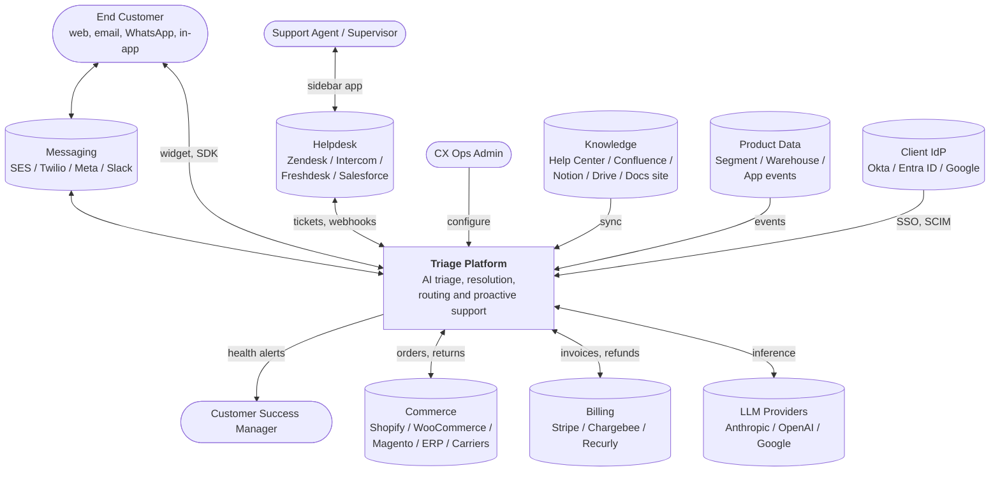

---

## 15. Container Architecture (C4 Level 2)

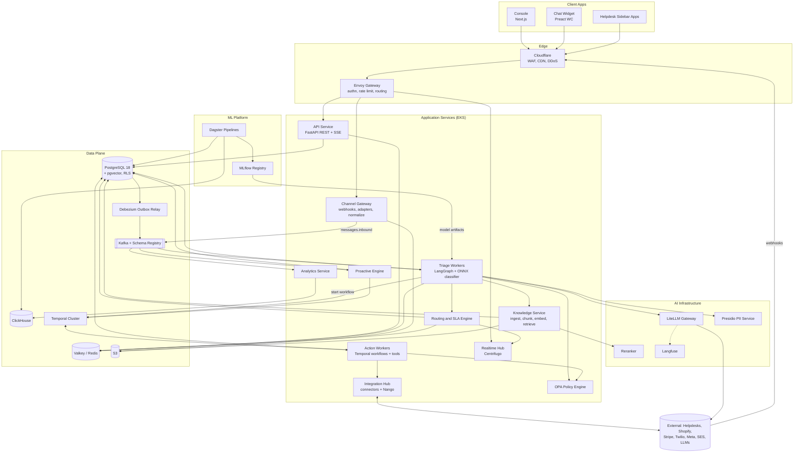

### 15.1 Request paths
| Path | Sync / Async | Route |
|---|---|---|
| Chat message (widget) | Async-with-stream | Widget → API (`POST /messages`, returns `202` + stream URL) → Kafka → Triage worker → response tokens published to Realtime Hub → SSE to widget |
| Email / helpdesk webhook | Async | Provider → Channel Gateway (verify signature, persist raw to S3, ack `200`) → Kafka → Triage → Helpdesk API write-back |
| Console reads | Sync | Console → API → Postgres (RLS) / ClickHouse |
| Approvals | Async signal | Slack/Console → API → Temporal `signal(approve)` → workflow resumes |
| Business events (Stripe, Shopify) | Async | Provider → Channel Gateway → `integration.events` topic → Proactive Engine / Health scorer |

---

## 16. Service Catalog

| Service | Responsibilities | Owns (data) | Consumes | Produces | Key SLO |
|---|---|---|---|---|---|
| **API** | AuthN/Z, REST for console & public API, SSE streams, admin config CRUD, approval endpoints | tenants, users, policies, taxonomy, config | — | `config.changed` | P95 < 200 ms |
| **Channel Gateway** | Provider webhooks (signature verification), polling fallbacks, canonical normalization, idempotency, raw archival, outbound delivery | channels, raw payloads (S3) | `messages.outbound` | `messages.inbound`, `integration.events` | Ack < 300 ms; 0 loss |
| **Triage Workers** | Coalescing, agent graph execution, classification, extraction, urgency, retrieval orchestration, composition, guardrails, decision | triage_runs, predictions, entities, drafts, handoffs | `messages.inbound`, `config.changed` | `triage.completed`, `messages.outbound`, `action.requested`, `routing.requested` | Chat P95 < 6 s |
| **Knowledge Service** | Source connectors, parsing, chunking, embedding, hybrid search + rerank API, gap analysis | knowledge_sources, documents, chunks | `kb.sync.requested` | `kb.document.indexed` | Retrieval P95 < 400 ms |
| **Action Workers** | Tool registry, Temporal workflows (refund, RMA, reset...), approvals, compensation | action_definitions, action_executions, approvals | `action.requested`, signals | `action.completed`, `approval.requested` | Exactly-once |
| **Routing & SLA** | Skill-based assignment, priority queues, SLA timers, breach prediction, helpdesk write-back | teams, skills, agent_profiles, assignments, sla_* | `routing.requested`, presence | `routing.assigned`, `sla.breach_risk` | Assign P95 < 1 s |
| **Proactive Engine** | Trigger evaluation, suppression, outreach orchestration, attribution | proactive_triggers, proactive_events | `integration.events`, `product.events` | `messages.outbound` | Eval P95 < 5 s |
| **Integration Hub** | Connector SDK, OAuth (Nango), rate limiting per provider, sync cursors, schema mapping | integrations, sync_state | — | `integration.events` | — |
| **Analytics** | Stream events into ClickHouse, metric APIs, scheduled reports, warehouse export | ClickHouse tables | all `*.v1` topics | — | Dashboard P95 < 1 s |
| **ML Platform** | Dataset assets, training, calibration, eval gates, registry, promotion, KB gap clustering | model_versions, eval_runs, MLflow | feedback, conversations | `model.promoted` | Weekly cadence |

---

## 17. The Triage Agent (Agent Graph Design)

### 17.1 Graph overview

The agent is a **LangGraph `StateGraph`** with a Postgres checkpointer. Every node is a pure-ish function of `TriageState` and returns a state delta. The interrupt points let the graph pause for human approval or customer clarification and resume later. A resumed run can happen hours afterwards, on a different worker.

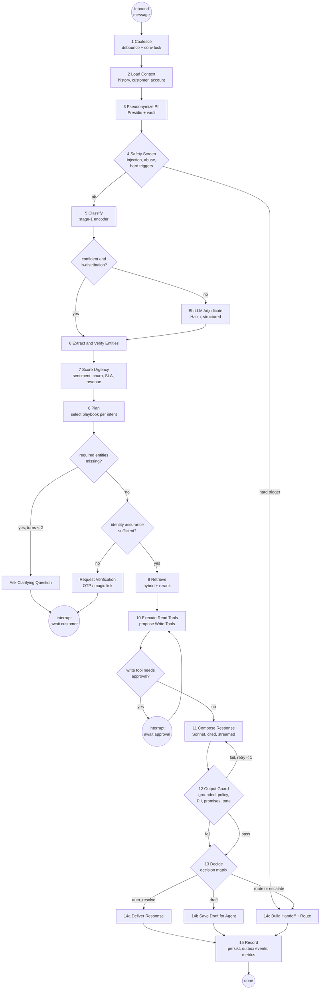

### 17.2 Coalescing & concurrency
- **Per-conversation ordering:** the Kafka partition key is `tenant_id:conversation_id`, so a conversation's messages are processed in order by one consumer.
- **Debounce:** for chat, the worker waits for a **quiet window** (default 4 s, max 12 s) before starting a run, merging bursts ("hi" / "my order" / "#48213 is late") into one run.
- **Lock:** `SET conv:lock:{conv_id} NX PX 30000` (renewed by heartbeat). If a new message arrives mid-run, the run is **cancelled at the next node boundary** and restarted with the merged input. Completed side effects are preserved via idempotency.

### 17.3 Two-stage classification
```
Stage 1 (always, ~20 ms):   encoder(text) → sigmoid scores per intent → temperature-scaled → p_i
                            OOD score = energy(logits) + d(embedding, nearest centroid)

Stage 2 (only if needed):   triggered when max(p_i) < τ_stage2 (default 0.80)
                            OR ≥ 2 intents within 0.15 of each other
                            OR OOD score > τ_ood
                            OR message length > 1,500 tokens / multiple questions detected
                            → Haiku with taxonomy (names + descriptions + 3 examples each,
                              retrieved by embedding similarity: top-25 candidate intents),
                              structured output: [{intent_key, confidence, evidence_span}]

Final:                      ensemble = calibrated blend (stage-1 weight learned per tenant)
                            intents with p ≥ τ_label (default 0.5) are kept (multi-label)
```
About 70–80% of traffic is fully decided by Stage 1, which keeps latency and cost low.

### 17.4 Autonomy levels & decision matrix

**Autonomy levels** (configured per `intent × channel × segment`):

| Level | Name | Customer-visible AI reply | Read tools | Write tools |
|---|---|---|---|---|
| **L0** | Shadow | ✗ (logged only) | ✓ | dry-run only |
| **L1** | Assist | ✗ (draft for agent) | ✓ | proposed to agent (one-click) |
| **L2** | Supervised | ✓ | ✓ | require approval |
| **L3** | Autonomous | ✓ | ✓ | auto within policy limits; approval above limits |

**Decision matrix**. Rules are evaluated top-down, and the first match wins:

| # | Condition | Decision |
|---|---|---|
| 1 | Hard trigger (legal, chargeback, safety, breach, regulator) **or** intent flagged `human_only` | **escalate** (P1/P2, specialist team) |
| 2 | Kill switch active or tenant/channel at L0 | **shadow** (record only, route normally) |
| 3 | Any guard failure after 1 regeneration | **route** with draft + guard report |
| 4 | Required entity missing and clarification turns < 2 | **ask_clarification** |
| 5 | min(calibrated confidence over detected intents) < `τ_route` (default 0.60) **or** OOD | **route** |
| 6 | Urgency ≥ 80 **or** VIP-human-preferred **or** sentiment ≤ −0.7 with ≥ 2 prior contacts | **draft + route (priority)** |
| 7 | Autonomy level of any detected intent = L1 | **draft** |
| 8 | Write action pending approval | **await_approval** (holding reply sent if L2+) |
| 9 | All intents ≥ `τ_auto` (default 0.85, per-intent override) **and** level ≥ L2 **and** groundedness ≥ 0.9 | **auto_resolve** |
| 10 | Otherwise | **draft** |

For **multi-intent** messages, the conversation's decision is the **most conservative** decision across intents. The composed reply may still answer the resolvable parts ("I've checked your shipping status…, and I've passed your refund request to our team").

### 17.5 Identity assurance levels (IAL)
| IAL | How established | Unlocks |
|---|---|---|
| **IAL0** | Anonymous chat | Public KB answers only |
| **IAL1** | Email/phone matches a customer record (channel-asserted: inbound email from address, WhatsApp number) | Order status for orders tied to that identity, tracking |
| **IAL2** | Signed in-app JWT from the tenant, or OTP / magic link confirmed in this session | Returns, refunds within limits, invoice retrieval, plan info |
| **IAL3** | IAL2 + step-up (recent re-auth) or human agent verification | Password/MFA reset requests, payment method or email change (always human-executed for email change) |

Each tool declares `min_ial`. The graph's **Verify Identity** node blocks the action until the required level is met.

### 17.6 Output guardrails (node 12)
| Check | Method | On failure |
|---|---|---|
| **Groundedness** | Claim extraction → each claim must map to retrieved chunk IDs or tool outputs (Haiku NLI, structured) | Regenerate once with stricter prompt → route |
| **Policy compliance** | OPA evaluation on structured intent of reply (e.g., refund promise ≤ policy window) | Route |
| **Promise detection** | Classifier flags commitments ("we will refund", "you'll receive") without a matching executed or approved action | Rewrite to non-committal or route |
| **PII leak** | Presidio scan of output; any PII not belonging to this customer → block | Block + alert |
| **Internal content leak** | Citations must reference `audience='public'` chunks only | Regenerate |
| **Tone / brand** | Tenant tone rubric (sampled LLM judge offline; lightweight online classifier) | Log; regenerate if severe |
| **Language** | Reply language = customer language | Regenerate |

### 17.7 `TriageState` (abridged)
```python
class TriageState(BaseModel):
    tenant_id: UUID
    conversation_id: UUID
    run_id: UUID
    message_ids: list[UUID]                 # coalesced inbound messages
    channel: ChannelType
    language: str | None
    pseudonymized_text: str                 # PII replaced with <EMAIL_1>, <PERSON_1>...
    history: list[ConversationTurn]         # last N turns, summarized beyond window
    customer: CustomerContext | None        # profile, LTV, segment, IAL
    account: AccountContext | None          # SaaS: plan, MRR, renewal, health
    intents: list[IntentPrediction]         # key, calibrated p, source(stage1|llm|ensemble)
    ood_score: float
    entities: list[VerifiedEntity]          # type, normalized value, verified: bool, owner_match
    sentiment: SentimentSignal
    urgency: UrgencyScore                   # score, priority, contributing factors
    hard_triggers: list[str]
    playbooks: list[PlaybookPlan]           # per intent: required entities, tools, policy refs
    retrieved: list[RetrievedChunk]
    tool_calls: list[ToolCallRecord]        # read results + proposed/executed writes
    draft: ComposedResponse | None          # text, citations, language
    guard: GuardReport | None
    decision: Decision | None               # enum + reasons[]
    autonomy: AutonomyResolution            # effective level per intent
    clarification_turns: int = 0
    cost: CostAccumulator                   # tokens, $ per model
    trace_id: str
```

### 17.8 Prompt architecture
- **Layered system prompt:** (1) platform safety rules → (2) tenant persona and tone → (3) channel style (chat = short, email = structured) → (4) playbook instructions for detected intents → (5) policies in effect (rendered from OPA data) → (6) tool schemas.
- **Untrusted content fencing:** customer messages and retrieved chunks go inside explicit tagged blocks, and the instructions say content inside them is **data**.
- **Prompts are versioned in Langfuse**, referenced by `prompt_version` in each `triage_run`, and promoted through the same eval gates as models.

---

## 18. Knowledge & RAG Pipeline

### 18.1 Ingestion
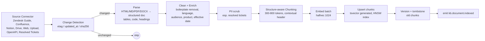

- **Resolved tickets as knowledge:** high-CSAT, human-resolved tickets are distilled by an LLM into Q&A pairs ("problem → resolution steps"). They are PII-scrubbed and stored with `audience='internal'` (agent assist) unless an admin promotes them to public.
- **Product catalog (e-commerce):** this is structured data, so it is not chunked. It is queried via tools (`product.search`, `inventory.check`) for freshness.

### 18.2 Retrieval
```
query_rewrite (Haiku; only if conversation is multi-turn) → standalone question + keywords
   │
   ├── dense:   ORDER BY embedding <=> :q  LIMIT 50   (filters: tenant, audience, locale, product, status='active')
   ├── lexical: ts_rank_cd(tsv, websearch_to_tsquery(:q)) LIMIT 50   + trigram for codes/IDs
   │
   ▼
RRF fusion (k=60) → top 40 → cross-encoder rerank → top 6 (score ≥ τ_rel)
   │
   ▼
context packing: dedupe by document, keep heading path, order by doc then position,
                 cap 4,000 tokens; attach chunk IDs for citation
```
If no chunk passes `τ_rel`, the retrieval sets `knowledge_gap=true`. This blocks auto-resolve for knowledge intents and logs the query for gap analysis.

---

## 19. Action Engine & Tool Framework

### 19.1 Tool contract
```python
@tool(
    key="commerce.refund.create",
    risk_tier=RiskTier.FINANCIAL,          # READ | LOW_WRITE | HIGH_WRITE | FINANCIAL
    min_ial=IAL.IAL2,
    integrations=["shopify", "stripe"],
    idempotent=True,
    compensation="commerce.refund.void",   # if supported
)
class CreateRefund(ToolSpec):
    class Input(BaseModel):
        order_ref: VerifiedEntityRef        # must reference a verified entity; never free text
        line_items: list[LineItemRef]
        amount_cents: conint(gt=0)
        reason: RefundReason
    class Output(BaseModel):
        refund_id: str
        status: Literal["pending", "succeeded"]
        amount_cents: int
```
- The LLM **proposes** tool calls. The engine **binds** arguments to verified entities, **validates** them against the schema, **authorizes** them via OPA (`data.triage.actions.allow`), then **executes**.
- Read tools run inline as Temporal *local activities* (fast). Write tools always run as full workflows.

### 19.2 Write-action workflow (Temporal)
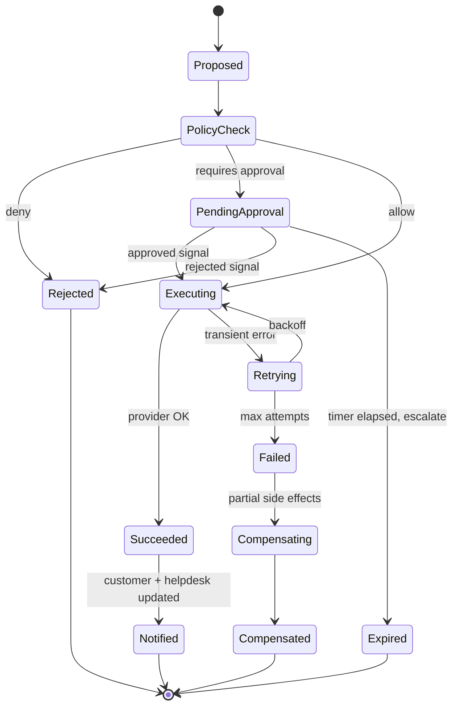

- **Idempotency key:** `sha256(tenant_id | conversation_id | tool_key | canonical_json(bound_args))`. It is used as the Temporal workflow ID (dedupe) and passed to providers (`Idempotency-Key` header for Stripe).
- **Multi-step sagas:** an example is *Return + Label + Refund-on-receipt*. Each step has a compensating action, and the workflow waits on a carrier "delivered to warehouse" event, possibly for days.

### 19.3 Approval routing
- Approval policies come from OPA, for example: refund > $150, or customer LTV < $50 with refund > $50, require a `supervisor`.
- Requests go to the console inbox plus a Slack/Teams interactive message (Approve / Reject / Open). The request has an expiry (default 4 business hours) and escalates to the next approver tier.
- Approver identity is checked via SSO-linked Slack user mapping. Every decision is written to `approvals` and `audit_log`.

### 19.4 Starter tool catalog
| Domain | Tool key | Risk | Min IAL |
|---|---|---|---|
| Commerce | `commerce.order.get`, `commerce.order.list_for_customer` | READ | IAL1 |
| Commerce | `shipping.tracking.get` | READ | IAL1 |
| Commerce | `commerce.return.eligibility`, `commerce.return.create`, `shipping.label.create` | LOW_WRITE | IAL2 |
| Commerce | `commerce.refund.create` | FINANCIAL | IAL2 |
| Commerce | `commerce.order.cancel`, `commerce.order.update_address` | HIGH_WRITE | IAL2 |
| Commerce | `catalog.product.search`, `inventory.check`, `inventory.restock_subscribe` | READ / LOW_WRITE | IAL0 / IAL1 |
| Commerce | `promo.code.validate` | READ | IAL0 |
| Billing | `billing.subscription.get`, `billing.invoice.list`, `billing.invoice.get_pdf` | READ | IAL2 |
| Billing | `billing.plan.preview_change`, `billing.plan.change` | READ / FINANCIAL | IAL2 |
| Billing | `billing.payment_method.update_link` | LOW_WRITE | IAL2 |
| Account | `account.password_reset.send_link` (to email on file only) | LOW_WRITE | IAL1 |
| Account | `account.unlock`, `account.mfa_reset.request` | HIGH_WRITE | IAL3 |
| SaaS | `usage.quota.get`, `status.incidents.get`, `docs.api.lookup` | READ | IAL0–IAL2 |
| Helpdesk | `helpdesk.ticket.update`, `helpdesk.ticket.add_note` | LOW_WRITE | system |

### 19.5 Integration connector SDK
Each connector implements typed interfaces (`HelpdeskConnector`, `CommerceConnector`, `BillingConnector`, `KnowledgeConnector`). Each provides `capabilities()`, a per-provider **token bucket** (Redis), **circuit breaker**, **retry policy** and **field mapping** (tenant-configurable custom fields). Webhook handlers verify provider signatures (Shopify HMAC, Stripe signature, Zendesk signing secret) before anything else.

### 19.6 Helpdesk synchronization model
| Data | System of record | Sync direction | Conflict rule |
|---|---|---|---|
| Ticket status, assignee, group | **Helpdesk** | Triage writes on decision; reads webhooks | Human changes in the helpdesk always win; Triage never overwrites a human-set assignee |
| Public replies | Both (append-only) | Triage posts AI replies via the helpdesk API as the "AI Agent" user | Ordered by provider timestamp |
| Tags / custom fields (intent, urgency, AI-handled) | **Triage** | Triage → Helpdesk | Triage-owned fields are namespaced (`triage_*`) |
| AI decisions, actions, audit | **Triage** | — | — |

---

## 20. Routing & Prioritization Engine

### 20.1 Urgency score
$$
U = 100 \cdot \sigma\Big(\sum_k w_k \cdot f_k\Big), \quad f_k \in [0,1]
$$

| Factor $f_k$ | Signal | Default weight |
|---|---|---|
| Negative sentiment | `max(0, -sentiment)` with trend amplifier | 0.20 |
| Churn signal | Cancel/downgrade intent, competitor mention, "last time" phrasing | 0.20 |
| SLA risk | `elapsed / sla_budget` | 0.15 |
| Revenue impact | Normalized LTV / ARR percentile; order value | 0.15 |
| Intent base priority | From taxonomy (`p1`=1.0 … `p4`=0.25) | 0.15 |
| Repeat contact | Contacts on same issue in 7 days (capped at 3) | 0.10 |
| Incident linkage | Part of a detected incident cluster | 0.05 |

Mapping: **P1 ≥ 80 · P2 60–79 · P3 35–59 · P4 < 35**. Hard triggers force P1. Weights are tenant-tunable, and every score stores its **factor breakdown** for explainability.

### 20.2 Assignment algorithm
1. **Candidate filter (hard constraints):** team eligibility (routing rules), online/available, `active_load < max_concurrent`, language match, required skill present.
2. **Score each candidate:**
   `score = 0.45·skill_match + 0.25·(1 − load/capacity) + 0.20·historical_csat_for_intent + 0.10·continuity` (previous agent on this customer).
3. **Assign** the top candidate atomically (Redis Lua script: check capacity → increment load → record). Write back to the helpdesk.
4. If no candidate, **enqueue** in the team queue (Redis sorted set scored by `priority_rank * 1e13 + sla_due_epoch_ms`, which is EDF within priority).
5. **Reclaim** if not accepted within N minutes (default 5 for P1, 15 otherwise). **Rebalance** when an agent goes offline.

### 20.3 SLA engine
- SLA policies match on (priority, segment, channel) and define first response, next response and resolution targets, with business-hours calendars per team.
- Timers are **Temporal durable timers** (one workflow per active SLA clock). They emit `sla.warning` at 75% and `sla.breached` at 100%.
- **Breach prediction:** queue position × average handle time vs. remaining budget. A predicted breach triggers a priority bump or overflow routing.

---

## 21. Proactive Engine & Account Health

### 21.1 Trigger pipeline
```
integration.events / product.events
   → normalize to BusinessEvent (type, customer ref, payload)
   → match active triggers (event_type + CEL conditions)
   → suppression checks (in order):
        consent/opt-out → open ticket on same topic → cooldown per trigger
        → frequency cap per customer/week → quiet hours (customer TZ) → holdout group (5% for lift measurement)
   → render message (template + optional LLM personalization, grounded on event payload)
   → deliver on preferred channel → track outcome (conversion event within attribution window)
```
Conditions use **CEL (Common Expression Language)**, for example `event.amount_cents > 5000 && customer.segment == "enterprise"`. CEL is safe, fast and non-Turing-complete.

### 21.2 Account health score (SaaS)
- **Inputs (daily, Dagster asset):** product usage trend (WAU/seats, key-feature adoption), support friction (ticket volume vs. cohort, unresolved P1/P2, negative sentiment trend), billing state (failed payments, downgrades), renewal proximity, NPS/CSAT.
- **Model:** gradient-boosted classifier (**LightGBM**) predicting 90-day churn or contraction. The output is calibrated to a 0–100 health score, with **SHAP** top-3 factors as the explanation.
- **Actions:** score drop > 15 pts or risk = high → CSM alert (Slack + CRM task) with factors and suggested playbook.

---

## 22. Continuous Learning Loop (MLOps / LLMOps)

```mermaid
flowchart LR
    subgraph COLLECT["Collect (continuous)"]
        F1["Agent intent corrections"]
        F2["Routing corrections"]
        F3["Draft edits, edit distance"]
        F4["CSAT, reopens, escalations"]
    end
    COLLECT --> DS["Dataset Builder<br/>Dagster weekly<br/>dedupe, PII scrub,<br/>label precedence"]
    DS --> TR["Train tenant adapter<br/>SetFit + multi-label head"]
    TR --> CAL["Calibrate<br/>temperature scaling"]
    CAL --> EV{"Eval Gates<br/>holdout + golden set"}
    EV -->|fail| ALERT["Alert ML on-call<br/>keep current model"]
    EV -->|pass| REG["MLflow Registry<br/>stage = shadow"]
    REG --> SH["Shadow 48h<br/>dual-predict live traffic"]
    SH --> CAN{"Canary 10%<br/>online metrics OK?"}
    CAN -->|no| RB["Auto-rollback"]
    CAN -->|yes| PROM["Promote = active<br/>emit model.promoted"]
    PROM --> WRK["Triage workers<br/>hot-reload ONNX"]
```

**Label precedence:** human correction > agent-confirmed (ticket closed without re-tag, CSAT ≥ 4) > LLM-labelled (Opus, confidence ≥ 0.9) > weak heuristics.

**Promotion gates (all must pass):**
| Gate | Threshold |
|---|---|
| Macro-F1 vs. active model | ≥ −0.5 pt (no regression) and overall ≥ target |
| Recall on P1-priority & `human_only` intents | ≥ 0.98 (missing an escalation is the costliest error) |
| ECE | ≤ 0.05 |
| Golden-set accuracy (curated, human-verified) | ≥ 95% |
| Per-intent regression | No intent drops > 3 pts with support ≥ 30 |
| Shadow agreement / online accuracy (from corrections) | ≥ active model |

**Prompt & RAG changes** go through the same lifecycle: a **promptfoo** regression suite in CI → nightly **Ragas** on golden Q&A → canary via feature flag → promotion.

**Drift monitoring:** population stability index (PSI) on intent distribution, embedding-centroid drift, rising OOD rate, and falling confidence. Each triggers investigation and gap analysis.

---

## 23. Event-Driven Backbone

### 23.1 Topics
| Topic | Key | Producer | Consumers | Retention |
|---|---|---|---|---|
| `messages.inbound.v1` | `tenant:conversation` | Channel Gateway | Triage, Analytics | 7 d |
| `messages.outbound.v1` | `tenant:conversation` | Triage, Proactive, API | Channel Gateway | 7 d |
| `conversation.events.v1` | `tenant:conversation` | Outbox (Debezium) | Analytics, Routing, Realtime | 30 d |
| `triage.completed.v1` | `tenant:conversation` | Triage | Analytics, ML | 30 d |
| `action.events.v1` | `tenant:conversation` | Action Workers | Analytics, Triage (resume) | 30 d |
| `routing.events.v1` | `tenant:team` | Routing | Analytics, Realtime | 7 d |
| `integration.events.v1` | `tenant:customer` | Channel Gateway | Proactive, Health, Sync | 7 d |
| `kb.events.v1` | `tenant:source` | Knowledge | Analytics, cache invalidation | 7 d |
| `feedback.events.v1` | `tenant` | API | ML Platform, Analytics | 90 d |
| `config.changed.v1` | `tenant` | API (outbox) | All workers (cache bust) | 7 d (compacted) |
| `audit.v1` | `tenant` | Outbox | Audit sink (S3 Object Lock), SIEM | 30 d |
| `*.dlq` | same | Any consumer | Ops tooling (replay UI) | 30 d |

### 23.2 Guarantees
- **Transactional outbox:** services write domain state and the `outbox` row in **one Postgres transaction**. Debezium streams the outbox to Kafka, so there are no dual-write inconsistencies.
- **At-least-once delivery + idempotent consumers:** every consumer records `(consumer_name, event_id)` in a processed-events set (Redis with 7-day TTL, or a Postgres unique constraint for critical paths).
- **Envelope:** CloudEvents 1.0 attributes + Protobuf payload. Schemas are compatibility-checked (`BACKWARD_TRANSITIVE`) in CI.
- **Poison messages:** 3 retries with exponential backoff, then DLQ with error context. The console replay tool lets an operator re-drive messages after a fix.

---

## 24. Multi-Tenancy & Data Isolation

| Layer | Mechanism |
|---|---|
| **Database** | `tenant_id` on every tenant-scoped table, leading every composite index; **Postgres RLS** `USING (tenant_id = current_setting('app.tenant_id')::uuid)` with `FORCE ROW LEVEL SECURITY`; app connects as a non-owner role without `BYPASSRLS` |
| **Session binding** | Each request/job begins a transaction with `SET LOCAL app.tenant_id = ...` (set by middleware from the verified JWT or event envelope); PgBouncer in transaction mode |
| **Vectors** | Same RLS on `kb.document_chunks`; tenant filter applied before ANN (HNSW iterative scans so the filter doesn't starve recall) |
| **Cache** | All keys prefixed `t:{tenant_id}:` |
| **Kafka** | `tenant_id` in partition key and envelope; consumers set DB tenant context from the envelope, never from the payload body |
| **Object storage** | `s3://{cell}-triage-data/{tenant_id}/...` + per-tenant KMS data key; IAM conditions on prefix |
| **ML artifacts** | Per-tenant adapters stored under tenant prefix; loader validates tenant match |
| **LLM calls** | Tenant ID in gateway metadata for budgets/audit; zero data retention with providers; no cross-tenant few-shot examples |
| **Noisy neighbours** | Per-tenant token buckets at the gateway, per-tenant Kafka consumer quotas, LLM budgets, fair-share scheduling in triage workers |
| **Enterprise isolation tiers** | *Pooled* (default) → *Dedicated DB schema* → *Dedicated cell / single-tenant VPC* |

---

## 25. Security & Compliance Architecture

### 25.1 Data protection
- **Encryption:** TLS 1.3 everywhere (mTLS inside the mesh). AES-256 at rest (RDS, S3, MSK, EBS).
- **Envelope encryption for message content:** raw message bodies are encrypted with a per-tenant **DEK** (wrapped by KMS CMK, or the client's key for BYOK) and stored in `messages.body_ciphertext`. The pseudonymized text (`body_redacted`) is used for AI, search and analytics.
- **Reversible pseudonymization vault:** Presidio replaces PII with typed tokens (`<EMAIL_1>`, `<PHONE_1>`, `<PERSON_1>`). The mapping is stored encrypted in `vault.pii_tokens` with TTL. LLM outputs are **re-hydrated** only at delivery time, inside the Channel Gateway.
- **Retention:** configurable per tenant (default: raw content 24 months, redacted analytics 36 months, audit 7 years). Erasure jobs crypto-shred by destroying the subject's DEK where applicable, and hard-delete rows.

### 25.2 Identity & access
- Workforce SSO (SAML/OIDC via WorkOS), SCIM de-provisioning, enforced MFA for non-SSO, session timeout policies.
- **RBAC roles:** Owner, Admin, Supervisor, Agent, Analyst, Developer, Auditor. Fine-grained rules (e.g., "Supervisors approve refunds ≤ $1,000 for their teams") are expressed in OPA.
- API keys are hashed (Argon2id), prefixed for identification (`trg_live_…`), scoped, with expiry and rotation.

### 25.3 Audit
- `audit.audit_log` is **append-only**: `UPDATE`/`DELETE` are revoked, and each row carries a **hash chain** (`hash = sha256(prev_hash || canonical_row)`) for tamper evidence.
- Logs are exported daily to S3 with **Object Lock (compliance mode)**, and audit logs stream to the client's SIEM (WorkOS Audit Logs / webhook).
- Every AI decision is reconstructable: inputs (redacted), model and prompt versions, retrieved chunks, tool calls, policy evaluations, guard results, decision.

### 25.4 LLM-specific threat model (OWASP LLM Top 10)
| Threat | Controls |
|---|---|
| **Prompt injection (direct/indirect)** | Untrusted-content fencing; injection classifier on input and retrieved chunks; tools limited to the active playbook's allow-list; arguments bound to verified entities; OPA authorization independent of the LLM; no tool can change the authorization context |
| **Sensitive information disclosure** | Pseudonymization before LLM; output PII scan; audience filter (internal vs. public KB); customer can only reference their own entities (ownership verification) |
| **Excessive agency** | Risk tiers, IAL gates, approvals, per-action limits, dry-run, kill switch |
| **Insecure output handling** | Outputs rendered as sanitized Markdown (allow-listed tags); no HTML/JS passthrough; links allow-listed to tenant domains + carriers |
| **Model DoS / cost abuse** | Per-customer and per-tenant rate limits, max tokens per run, budget circuit breakers, CAPTCHA/bot management on widget (Cloudflare Turnstile) |
| **Training data poisoning** | Label precedence, anomaly detection on correction bursts from single users, human review of new intents |
| **Supply chain** | Pinned model versions in gateway config, signed images, SBOMs, dependency scanning |

### 25.5 Compliance roadmap
| Framework | Status at GA | Target |
|---|---|---|
| SOC 2 Type I | Controls implemented; Type I audit | GA + 1 month |
| SOC 2 Type II | Observation window running | GA + 7 months |
| GDPR / UK GDPR | DPA, SCCs, EU cell, DSAR & erasure workflows, RoPA | GA |
| CCPA/CPRA | Data inventory, opt-out handling | GA |
| EU AI Act | Transparency (AI disclosure), human oversight, logging | GA |
| HIPAA | BAA-eligible configuration (no PHI to non-BAA providers) | v2 on demand |
| ISO 27001 / 42001 | ISMS + AI management system | Year 2 |

---

## 26. Observability

| Signal | Tooling | Key content |
|---|---|---|
| **Traces** | OpenTelemetry → Tempo; LLM spans → Langfuse | One trace per triage run spanning gateway → Kafka → graph nodes → LLM → tools → delivery; `trace_id` stored on `triage_runs` |
| **Metrics** | Prometheus/Mimir | RED metrics per service; Kafka lag; graph node latency histograms; decision distribution; guard failure rate; LLM tokens/cost per tenant; Temporal workflow failures |
| **Logs** | Structured JSON → Loki | `tenant_id`, `conversation_id`, `run_id`, `trace_id` on every line; PII-free by policy (log scrubber processor) |
| **Errors / RUM** | Sentry | Backend exceptions, widget/console errors, Web Vitals |
| **AI quality** | Langfuse + ClickHouse | Groundedness trend, confidence histograms, draft acceptance, reopen rate per intent |

**SLOs with burn-rate alerting** (multi-window, multi-burn-rate via Sloth):
- Ingestion availability 99.9% · Chat response P95 < 6 s (99% of 5-min windows) · Zero message loss (DLQ age < 15 min) · Groundedness ≥ 0.95 (daily) · Autonomous false-resolution ≤ 5% (weekly).

---

## 27. Deployment, Infrastructure & Disaster Recovery

### 27.1 Cell-based topology
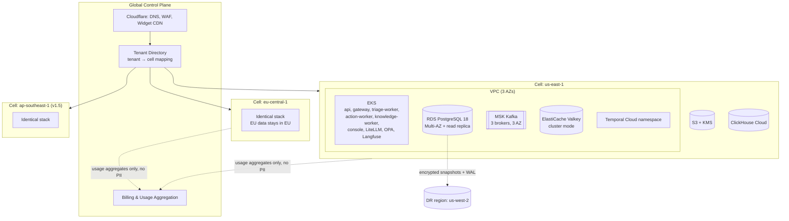

- Requests are routed to the tenant's cell by subdomain (`{tenant}.eu.triage.app`) or API key prefix. The global plane holds **no customer content**.
- **Environments:** `dev` (ephemeral preview environments per PR via ArgoCD ApplicationSets) → `staging` (production-like, synthetic and replayed traffic) → `prod` cells. A **sandbox** tenant tier lives in prod cells with dry-run tools.

### 27.2 Kubernetes workload design
| Workload | Replicas (min/max) | Autoscaler | Notes |
|---|---|---|---|
| `api` | 3 / 30 | HPA (CPU, RPS) | PodDisruptionBudget, topology spread across AZs |
| `gateway` | 3 / 40 | HPA (RPS) | Must ack fast; minimal work before durable write |
| `triage-worker` | 3 / 100 | **KEDA** (Kafka lag on `messages.inbound`) | ONNX model in memory; graceful drain on SIGTERM (finish node, checkpoint) |
| `action-worker` | 2 / 30 | KEDA (Temporal task queue backlog) | Separate task queues per risk tier |
| `knowledge-worker` | 1 / 20 | KEDA (queue depth) | Spot nodes allowed (idempotent, resumable) |
| `litellm` | 3 / 20 | HPA | Stateless; Redis-backed budgets |
| GPU pool (v2, vLLM/Triton) | 0 / N | Karpenter | Scale-to-zero outside Enterprise residency tenants |

**Releases:** Argo Rollouts canary (5% → 25% → 50% → 100%) with automated analysis on error rate, P95 latency and decision-distribution shift. Database migrations follow **expand → migrate → contract** (backward-compatible deploys).

### 27.3 Backup & DR
| Component | Backup | RPO | RTO |
|---|---|---|---|
| PostgreSQL | PITR (WAL, 35 days) + cross-region snapshot copy every 1 h + continuous WAL shipping to DR | ≤ 5 min | ≤ 1 h |
| Kafka | 3× replication across AZs; MirrorMaker 2 to DR for critical topics | ≤ 5 min | ≤ 1 h |
| S3 | Versioning + Cross-Region Replication | ≈ 15 min | ≤ 1 h |
| ClickHouse | Daily backups; rebuildable from Kafka/S3 | 24 h (acceptable) | ≤ 4 h |
| Temporal | Managed multi-AZ (Temporal Cloud) | provider SLA | provider SLA |
| Config / IaC | Git (source of truth) | 0 | Terraform re-apply |

Quarterly **game days** test region failover, LLM provider outage, Kafka broker loss and an expired helpdesk token.

---

## 28. Failure Modes & Graceful Degradation

| Failure | Detection | Degraded behaviour |
|---|---|---|
| Primary LLM provider down/slow | Gateway error rate / latency SLO | Fallback provider within ≤ 30 s; if all fail → classifier-only triage + route to humans with a templated acknowledgement |
| Classifier model fails to load | Health check | Use previous model version; else LLM-only classification (higher cost, logged) |
| Retrieval/reranker unavailable | Timeouts / breaker | Skip rerank (RRF only) → if search down, disable auto-resolve for knowledge intents (draft/route) |
| Commerce/billing API down | Circuit breaker open | Answer with "I've passed this to our team" + route; read cache (≤ 5 min) for order status if fresh |
| Helpdesk API rate-limited | 429 / headers | Coalesce writes, exponential backoff, queue write-backs; customer reply via native channel if possible |
| Kafka consumer lag spike | KEDA + alert | Scale out; prioritize chat over email (separate consumer groups / priority topics) |
| Postgres primary failure | RDS Multi-AZ failover | 30–60 s write unavailability; gateway buffers to Kafka (already durable), no loss |
| Guardrail service failure | Health check | **Fail closed**: no auto-send; drafts only |
| Cost budget exceeded (tenant) | Gateway budget | Downgrade composition model tier → then classifier + route only; alert tenant admin |
| Poisoned / malformed message | Exceptions | DLQ after 3 attempts; conversation flagged for human |

---

## 29. Unit Economics & Cost Controls

**Target:** blended AI cost **≤ $0.05 per conversation**, which gives **≥ 80% gross margin** at $0.25–$0.40 per ticket pricing.

| Component | Typical cost / conversation | Lever |
|---|---|---|
| Stage-1 classification (ONNX CPU) | ~$0.0001 | — |
| Stage-2 adjudication (Haiku, ~25% of traffic) | ~$0.002 | Raise stage-1 coverage via retraining |
| Entity extraction + urgency (Haiku) | ~$0.003 | Combine into one structured call |
| Embedding + rerank | ~$0.001 | Cache query embeddings per run |
| Composition (Sonnet, cached prefix, ~1.5 turns) | ~$0.02–0.03 | Prompt caching; Haiku for simple templated intents |
| Guardrail checks (Haiku) | ~$0.003 | Skip groundedness for pure tool-output replies (deterministic templates) |
| Infra (compute, DB, Kafka, storage) amortized | ~$0.01 | Spot for batch, right-sizing |

Per-tenant **budgets and alerts** are enforced at the LiteLLM gateway. A **cost per conversation** dashboard breaks spend down by intent and model.

---

# Part D — End-to-End Flows

## 30. Flow Catalogue

| # | Flow | Shows |
|---|---|---|
| F1 | Chat: autonomous WISMO resolution | Hot path, streaming, verification, tools, guard |
| F2 | Email via helpdesk: multi-intent with refund approval | Helpdesk sync, partial autonomy, Temporal approval saga |
| F3 | P1 escalation with handoff packet | Hard triggers, incident clustering, routing, sidebar |
| F4 | Clarification + identity step-up | Graph interrupts and resumption |
| F5 | Proactive outreach: failed payment | Business events, suppression, attribution |
| F6 | Agent correction → retraining → promotion | Learning loop |
| F7 | Shadow-mode evaluation & autonomy promotion | Safe rollout |
| F8 | Conversation lifecycle | State machine |

### F1 — Chat: Autonomous WISMO Resolution

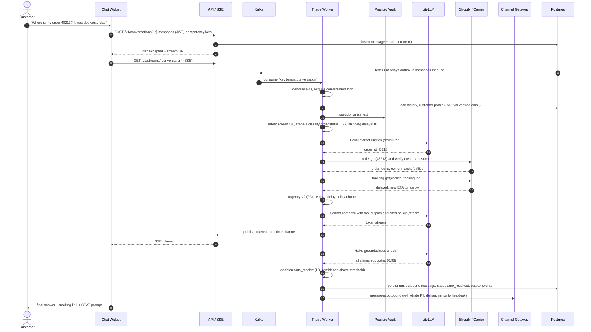

**Latency budget (P95):** debounce 4.0 s (chat only, overlaps typing) · context + PII 120 ms · classify 30 ms · extraction 600 ms · tools 700 ms (parallel) · retrieval 300 ms · first token 800 ms → **perceived first token ≈ 1.3 s after debounce**, full answer ≈ 4–5 s.

### F2 — Email via Helpdesk: Multi-Intent with Refund Approval

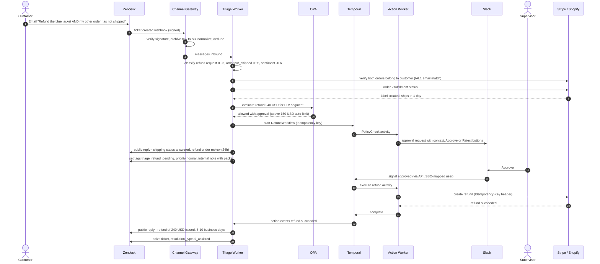

### F3 — P1 Escalation with Handoff Packet

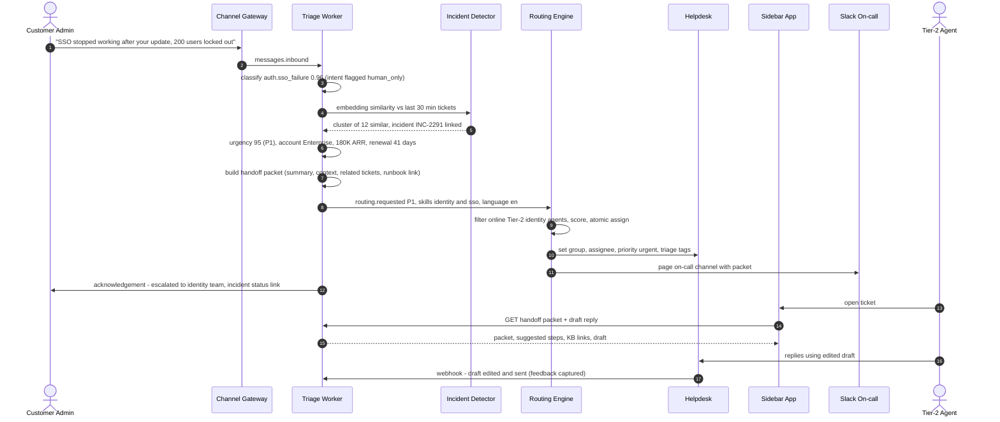

**Handoff packet structure:**
```json
{
  "tldr": "Enterprise admin reports SSO login failure for ~200 users after 2026-10-08 release; linked to INC-2291.",
  "intents": [{"key": "auth.sso_failure", "confidence": 0.96}],
  "urgency": {"score": 95, "priority": "P1", "factors": {"revenue_impact": 0.92, "incident_linkage": 1.0, "sentiment": 0.55}},
  "customer": {"name": "<PERSON_1>", "role": "IT Admin", "ial": "IAL1"},
  "account": {"plan": "Enterprise", "arr_usd": 180000, "renewal_in_days": 41, "health": 62, "csm": "user_123"},
  "verified_entities": [{"type": "workspace_id", "value": "ws_8812", "verified": true}],
  "attempted": [],
  "related": {"incident": "INC-2291", "similar_tickets": 12},
  "suggested_next_steps": ["Confirm IdP type (Okta/Entra)", "Apply SAML cert rollback per runbook RB-17", "Post updates every 30 min"],
  "kb_links": [{"title": "SSO troubleshooting (internal)", "url": "..."}],
  "sentiment_trend": [-0.4, -0.7]
}
```

### F4 — Clarification + Identity Step-Up (Graph Interrupts)

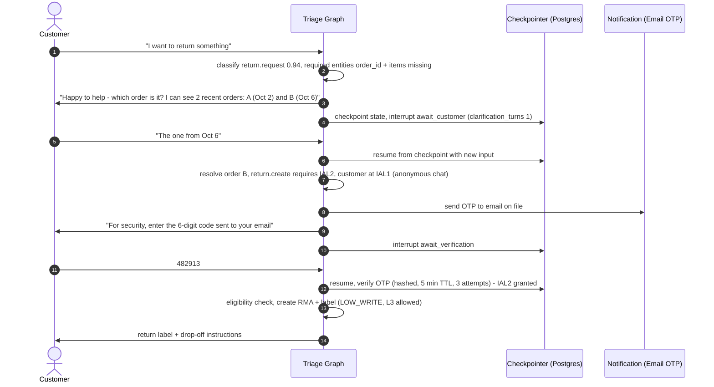

### F5 — Proactive Outreach: Failed Payment (SaaS)

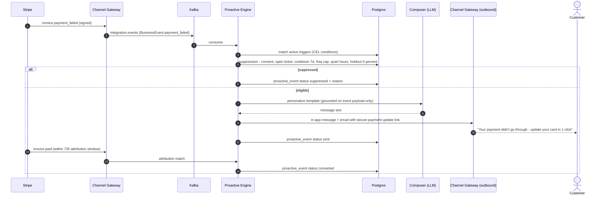

### F6 — Agent Correction → Retraining → Promotion

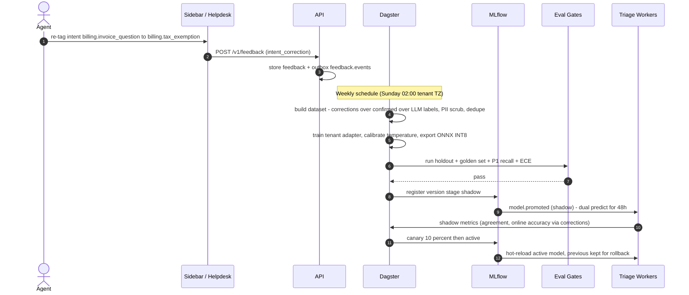

### F7 — Shadow-Mode Evaluation & Autonomy Promotion

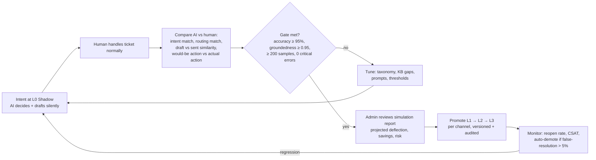

### F8 — Conversation Lifecycle

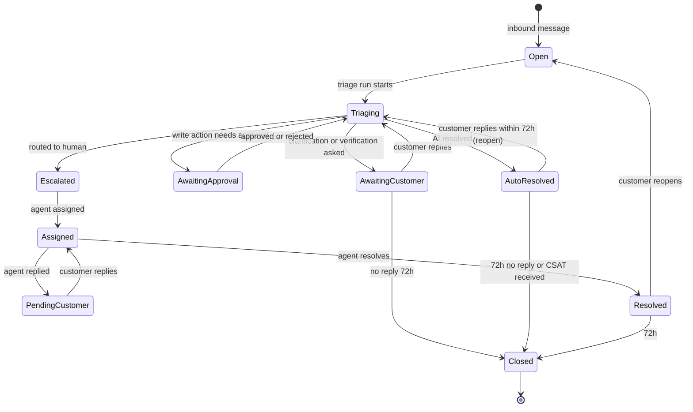

---

# Part E — Backend Schema

## 31. Data Model Overview (ERD)

**Conventions**
- **Primary keys:** tenant-scoped tables use the composite PK `(tenant_id, id)`, with `id` = **UUIDv7** (time-ordered, generated by PostgreSQL 18's native `uuidv7()`). Foreign keys include `tenant_id`, which makes **cross-tenant references structurally impossible**. The tables are also ready for Citus distribution by `tenant_id`.
- **Schemas:** `app` (operational domain), `kb` (knowledge), `ml` (models and evals), `audit` (append-only), `vault` (secrets and PII tokens, restricted role).
- **Timestamps:** `timestamptz` everywhere (UTC); `created_at` / `updated_at` maintained by trigger.
- **Money:** integer minor units (`amount_cents bigint`) + ISO-4217 `currency char(3)`.
- **Soft vs. hard delete:** operational records are retained per policy and hard-deleted by retention jobs. The audit trail is never deleted (except by legal-hold-aware retention).

### 31.1 Core conversation & triage domain
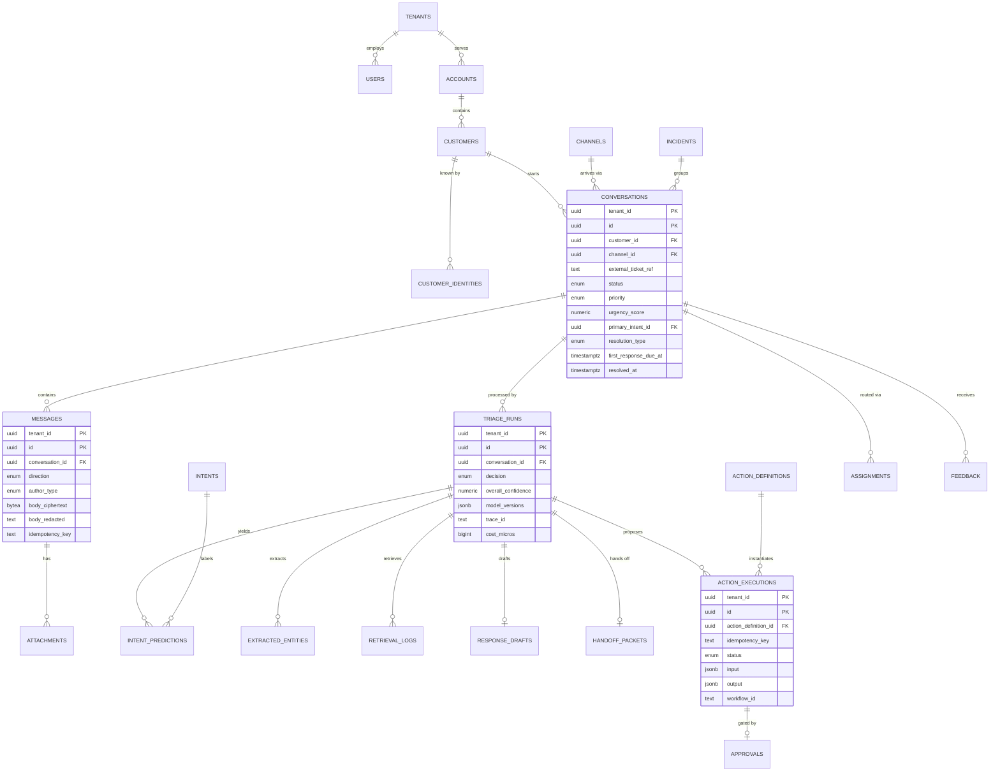

### 31.2 Configuration, knowledge, routing & ML domain
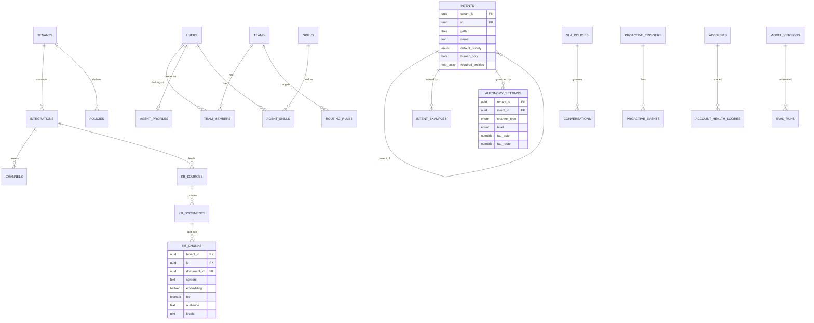

---

## 32. PostgreSQL Schema (DDL)

> Target: **PostgreSQL 18**, **pgvector ≥ 0.8**. Migrations are managed by Alembic. This DDL is the reference design.

### 32.1 Extensions, schemas, roles & types
```sql
-- ─────────────────────────────────────────────────────────────
-- Extensions
-- ─────────────────────────────────────────────────────────────
CREATE EXTENSION IF NOT EXISTS vector;      -- pgvector: halfvec, HNSW, iterative index scans
CREATE EXTENSION IF NOT EXISTS citext;      -- case-insensitive emails / slugs
CREATE EXTENSION IF NOT EXISTS pg_trgm;     -- fuzzy match on IDs, error codes
CREATE EXTENSION IF NOT EXISTS ltree;       -- hierarchical intent taxonomy
CREATE EXTENSION IF NOT EXISTS btree_gin;   -- composite GIN indexes

-- ─────────────────────────────────────────────────────────────
-- Schemas
-- ─────────────────────────────────────────────────────────────
CREATE SCHEMA app;     -- operational domain
CREATE SCHEMA kb;      -- knowledge base
CREATE SCHEMA ml;      -- models, datasets, evals
CREATE SCHEMA audit;   -- append-only audit trail
CREATE SCHEMA vault;   -- PII tokens & wrapped keys (restricted)

-- ─────────────────────────────────────────────────────────────
-- Roles (no role used by services has BYPASSRLS)
-- ─────────────────────────────────────────────────────────────
CREATE ROLE triage_owner   NOLOGIN;                 -- owns objects; used by migrations only
CREATE ROLE triage_app     NOLOGIN;                 -- application services
CREATE ROLE triage_vault   NOLOGIN;                 -- channel gateway / PII service only
CREATE ROLE triage_analyst NOLOGIN;                 -- read-only, RLS still applies

-- ─────────────────────────────────────────────────────────────
-- Enumerated types (stable domains only; volatile ones use CHECK)
-- ─────────────────────────────────────────────────────────────
CREATE TYPE app.industry            AS ENUM ('ecommerce','saas','other');
CREATE TYPE app.user_role           AS ENUM ('owner','admin','supervisor','agent','analyst','developer','auditor');
CREATE TYPE app.channel_type        AS ENUM ('email','web_chat','whatsapp','in_app','sms','voice',
                                             'facebook','instagram','x','slack','teams','api');
CREATE TYPE app.conversation_status AS ENUM ('open','triaging','awaiting_customer','awaiting_approval',
                                             'auto_resolved','escalated','assigned','pending_customer',
                                             'resolved','closed');
CREATE TYPE app.priority            AS ENUM ('p1','p2','p3','p4');
CREATE TYPE app.resolution_type     AS ENUM ('ai_autonomous','ai_assisted','human','abandoned','merged');
CREATE TYPE app.autonomy_level      AS ENUM ('L0','L1','L2','L3');
CREATE TYPE app.ial                 AS ENUM ('IAL0','IAL1','IAL2','IAL3');
CREATE TYPE app.message_direction   AS ENUM ('inbound','outbound','internal_note');
CREATE TYPE app.author_type         AS ENUM ('customer','ai_agent','human_agent','system');
CREATE TYPE app.triage_decision     AS ENUM ('auto_resolve','draft','route','escalate',
                                             'ask_clarification','await_approval','shadow');
CREATE TYPE app.run_status          AS ENUM ('running','interrupted','completed','failed','cancelled');
CREATE TYPE app.risk_tier           AS ENUM ('read','low_write','high_write','financial');
CREATE TYPE app.action_status       AS ENUM ('proposed','dry_run','pending_approval','approved','rejected',
                                             'expired','running','succeeded','failed',
                                             'compensating','compensated','cancelled');

-- ─────────────────────────────────────────────────────────────
-- Shared trigger: updated_at
-- ─────────────────────────────────────────────────────────────
CREATE FUNCTION app.touch_updated_at() RETURNS trigger
LANGUAGE plpgsql AS $$
BEGIN
  NEW.updated_at := now();
  RETURN NEW;
END $$;

-- Helper used by RLS policies (fails closed when unset)
CREATE FUNCTION app.current_tenant() RETURNS uuid
LANGUAGE sql STABLE AS $$
  SELECT nullif(current_setting('app.tenant_id', true), '')::uuid
$$;
```

### 32.2 Tenancy, identity & access
```sql
CREATE TABLE app.tenants (
  id              uuid PRIMARY KEY DEFAULT uuidv7(),
  slug            citext NOT NULL UNIQUE,
  name            text   NOT NULL,
  industry        app.industry NOT NULL,
  plan_tier       text   NOT NULL DEFAULT 'starter'
                  CHECK (plan_tier IN ('sandbox','starter','growth','scale','enterprise')),
  cell            text   NOT NULL,                     -- e.g. 'us-east-1'
  data_region     text   NOT NULL CHECK (data_region IN ('us','eu','apac')),
  status          text   NOT NULL DEFAULT 'provisioning'
                  CHECK (status IN ('provisioning','active','suspended','offboarding')),
  kms_key_arn     text   NOT NULL,                     -- per-tenant CMK or client BYOK
  kill_switch     boolean NOT NULL DEFAULT false,      -- forces L0 globally
  settings        jsonb  NOT NULL DEFAULT '{}'::jsonb, -- timezone, locales, branding, retention
  created_at      timestamptz NOT NULL DEFAULT now(),
  updated_at      timestamptz NOT NULL DEFAULT now()
);

CREATE TABLE app.users (
  tenant_id         uuid NOT NULL REFERENCES app.tenants(id),
  id                uuid NOT NULL DEFAULT uuidv7(),
  email             citext NOT NULL,
  full_name         text NOT NULL,
  role              app.user_role NOT NULL DEFAULT 'agent',
  status            text NOT NULL DEFAULT 'invited' CHECK (status IN ('invited','active','disabled')),
  idp_subject       text,                               -- SSO profile id
  helpdesk_user_ref text,                               -- Zendesk/Intercom agent id
  slack_user_ref    text,                               -- for approvals
  last_login_at     timestamptz,
  created_at        timestamptz NOT NULL DEFAULT now(),
  updated_at        timestamptz NOT NULL DEFAULT now(),
  PRIMARY KEY (tenant_id, id),
  UNIQUE (tenant_id, email)
);

CREATE TABLE app.api_keys (
  tenant_id          uuid NOT NULL REFERENCES app.tenants(id),
  id                 uuid NOT NULL DEFAULT uuidv7(),
  name               text NOT NULL,
  key_prefix         text NOT NULL UNIQUE,              -- 'trg_live_ab12cd' (display + lookup)
  key_hash           text NOT NULL,                     -- Argon2id
  scopes             text[] NOT NULL,                   -- {'conversations:read','kb:write',...}
  rate_limit_per_min int  NOT NULL DEFAULT 600,
  created_by         uuid,
  last_used_at       timestamptz,
  expires_at         timestamptz,
  revoked_at         timestamptz,
  created_at         timestamptz NOT NULL DEFAULT now(),
  PRIMARY KEY (tenant_id, id),
  FOREIGN KEY (tenant_id, created_by) REFERENCES app.users(tenant_id, id)
);

-- Versioned snapshots of any config entity → diff & one-click rollback
CREATE TABLE app.config_revisions (
  tenant_id     uuid NOT NULL REFERENCES app.tenants(id),
  id            uuid NOT NULL DEFAULT uuidv7(),
  entity_type   text NOT NULL,      -- 'intent','policy','autonomy_setting','prompt','routing_rule',...
  entity_id     uuid NOT NULL,
  version       int  NOT NULL,
  snapshot      jsonb NOT NULL,
  change_note   text,
  changed_by    uuid,
  created_at    timestamptz NOT NULL DEFAULT now(),
  PRIMARY KEY (tenant_id, id),
  UNIQUE (tenant_id, entity_type, entity_id, version)
);
```

### 32.3 Customers & accounts (CRM context)
```sql
CREATE TABLE app.accounts (                            -- B2B company (SaaS); optional for e-commerce
  tenant_id       uuid NOT NULL REFERENCES app.tenants(id),
  id              uuid NOT NULL DEFAULT uuidv7(),
  external_ref    text,                                -- CRM / billing account id
  name            text NOT NULL,
  domain          citext,
  plan            text,
  mrr_cents       bigint,
  currency        char(3),
  renewal_date    date,
  csm_user_id     uuid,
  health_score    smallint CHECK (health_score BETWEEN 0 AND 100),   -- latest (denormalized)
  attributes      jsonb NOT NULL DEFAULT '{}'::jsonb,
  created_at      timestamptz NOT NULL DEFAULT now(),
  updated_at      timestamptz NOT NULL DEFAULT now(),
  PRIMARY KEY (tenant_id, id),
  UNIQUE (tenant_id, external_ref),
  FOREIGN KEY (tenant_id, csm_user_id) REFERENCES app.users(tenant_id, id)
);

CREATE TABLE app.customers (
  tenant_id           uuid NOT NULL REFERENCES app.tenants(id),
  id                  uuid NOT NULL DEFAULT uuidv7(),
  account_id          uuid,
  external_ref        text,                            -- Shopify customer id / app user id
  email               citext,
  phone_e164          text,
  display_name        text,
  locale              text,
  timezone            text,
  segment             text,                            -- 'vip','enterprise','standard', tenant-defined
  lifetime_value_cents bigint,
  currency            char(3),
  marketing_consent   boolean NOT NULL DEFAULT false,
  proactive_opt_out   boolean NOT NULL DEFAULT false,
  attributes          jsonb NOT NULL DEFAULT '{}'::jsonb,
  erased_at           timestamptz,                     -- GDPR erasure marker
  created_at          timestamptz NOT NULL DEFAULT now(),
  updated_at          timestamptz NOT NULL DEFAULT now(),
  PRIMARY KEY (tenant_id, id),
  UNIQUE (tenant_id, external_ref),
  FOREIGN KEY (tenant_id, account_id) REFERENCES app.accounts(tenant_id, id)
);
CREATE INDEX customers_email_idx ON app.customers (tenant_id, email);
CREATE INDEX customers_phone_idx ON app.customers (tenant_id, phone_e164);

-- Cross-channel identity resolution
CREATE TABLE app.customer_identities (
  tenant_id     uuid NOT NULL,
  id            uuid NOT NULL DEFAULT uuidv7(),
  customer_id   uuid NOT NULL,
  channel_type  app.channel_type NOT NULL,
  handle        text NOT NULL,                         -- email, E.164, PSID, Slack user id, app user id
  verified_at   timestamptz,
  created_at    timestamptz NOT NULL DEFAULT now(),
  PRIMARY KEY (tenant_id, id),
  UNIQUE (tenant_id, channel_type, handle),
  FOREIGN KEY (tenant_id, customer_id) REFERENCES app.customers(tenant_id, id) ON DELETE CASCADE
);

-- Daily health history (latest is denormalized onto accounts)
CREATE TABLE app.account_health_scores (
  tenant_id      uuid NOT NULL,
  id             uuid NOT NULL DEFAULT uuidv7(),
  account_id     uuid NOT NULL,
  score          smallint NOT NULL CHECK (score BETWEEN 0 AND 100),
  risk_level     text NOT NULL CHECK (risk_level IN ('low','medium','high','critical')),
  churn_probability numeric(5,4) NOT NULL,
  top_factors    jsonb NOT NULL,                       -- SHAP contributions
  model_version_id uuid,
  computed_at    timestamptz NOT NULL DEFAULT now(),
  PRIMARY KEY (tenant_id, id),
  FOREIGN KEY (tenant_id, account_id) REFERENCES app.accounts(tenant_id, id) ON DELETE CASCADE
);
CREATE INDEX health_account_time_idx ON app.account_health_scores (tenant_id, account_id, computed_at DESC);
```

### 32.4 Integrations & channels
```sql
CREATE TABLE app.integrations (
  tenant_id          uuid NOT NULL REFERENCES app.tenants(id),
  id                 uuid NOT NULL DEFAULT uuidv7(),
  provider           text NOT NULL,      -- 'zendesk','intercom','freshdesk','salesforce','shopify',
                                         -- 'woocommerce','magento','stripe','chargebee','notion',
                                         -- 'confluence','gdrive','slack','teams','twilio','meta','segment','custom_http'
  category           text NOT NULL CHECK (category IN ('helpdesk','commerce','billing','crm','knowledge',
                                                       'messaging','analytics','shipping','custom')),
  display_name       text NOT NULL,
  status             text NOT NULL DEFAULT 'pending'
                     CHECK (status IN ('pending','connected','degraded','error','disconnected')),
  auth_type          text NOT NULL CHECK (auth_type IN ('oauth2','api_key','basic','jwt','none')),
  connection_ref     text,                -- Nango connection id / Secrets Manager ARN (never the secret)
  webhook_secret_ref text,                -- Secrets Manager ARN for signature verification
  scopes             text[] NOT NULL DEFAULT '{}',
  config             jsonb NOT NULL DEFAULT '{}'::jsonb,   -- subdomain, field mappings, store url
  health_checked_at  timestamptz,
  last_error         jsonb,
  created_at         timestamptz NOT NULL DEFAULT now(),
  updated_at         timestamptz NOT NULL DEFAULT now(),
  PRIMARY KEY (tenant_id, id),
  UNIQUE (tenant_id, provider, display_name)
);

CREATE TABLE app.integration_sync_state (
  tenant_id       uuid NOT NULL,
  integration_id  uuid NOT NULL,
  resource        text NOT NULL,            -- 'tickets','articles','orders','customers'
  cursor          text,                     -- provider cursor / updated_since watermark
  last_run_at     timestamptz,
  last_status     text CHECK (last_status IN ('ok','partial','failed')),
  stats           jsonb NOT NULL DEFAULT '{}'::jsonb,
  PRIMARY KEY (tenant_id, integration_id, resource),
  FOREIGN KEY (tenant_id, integration_id) REFERENCES app.integrations(tenant_id, id) ON DELETE CASCADE
);

CREATE TABLE app.channels (
  tenant_id       uuid NOT NULL REFERENCES app.tenants(id),
  id              uuid NOT NULL DEFAULT uuidv7(),
  type            app.channel_type NOT NULL,
  name            text NOT NULL,                       -- 'Support inbox', 'Website chat EU'
  integration_id  uuid,
  address         text,                                -- support@acme.com, +1555..., widget key
  config          jsonb NOT NULL DEFAULT '{}'::jsonb,  -- debounce_ms, business hours, greeting, ai_disclosure
  is_active       boolean NOT NULL DEFAULT true,
  created_at      timestamptz NOT NULL DEFAULT now(),
  updated_at      timestamptz NOT NULL DEFAULT now(),
  PRIMARY KEY (tenant_id, id),
  FOREIGN KEY (tenant_id, integration_id) REFERENCES app.integrations(tenant_id, id)
);

-- Outbound webhooks to the tenant's own systems
CREATE TABLE app.webhook_subscriptions (
  tenant_id     uuid NOT NULL REFERENCES app.tenants(id),
  id            uuid NOT NULL DEFAULT uuidv7(),
  url           text NOT NULL CHECK (url LIKE 'https://%'),
  event_types   text[] NOT NULL,                       -- {'conversation.escalated','action.succeeded'}
  secret_ref    text NOT NULL,
  is_active     boolean NOT NULL DEFAULT true,
  failure_count int NOT NULL DEFAULT 0,
  created_at    timestamptz NOT NULL DEFAULT now(),
  PRIMARY KEY (tenant_id, id)
);
```

### 32.5 Taxonomy, autonomy, policies & SLAs
```sql
CREATE TABLE app.sla_policies (
  tenant_id             uuid NOT NULL REFERENCES app.tenants(id),
  id                    uuid NOT NULL DEFAULT uuidv7(),
  name                  text NOT NULL,
  match                 jsonb NOT NULL,          -- {"priority":["p1"],"segment":["enterprise"],"channel":["email"]}
  first_response_mins   int NOT NULL,
  next_response_mins    int,
  resolution_mins       int,
  business_hours_only   boolean NOT NULL DEFAULT true,
  calendar              jsonb,                   -- business hours + holidays (per team override possible)
  rank                  int NOT NULL DEFAULT 100,-- lower = evaluated first
  is_active             boolean NOT NULL DEFAULT true,
  PRIMARY KEY (tenant_id, id)
);

CREATE TABLE app.teams (
  tenant_id     uuid NOT NULL REFERENCES app.tenants(id),
  id            uuid NOT NULL DEFAULT uuidv7(),
  name          text NOT NULL,
  helpdesk_group_ref text,                       -- Zendesk group id / Intercom team id
  timezone      text NOT NULL DEFAULT 'UTC',
  business_hours jsonb,
  created_at    timestamptz NOT NULL DEFAULT now(),
  PRIMARY KEY (tenant_id, id),
  UNIQUE (tenant_id, name)
);

CREATE TABLE app.intents (
  tenant_id          uuid NOT NULL REFERENCES app.tenants(id),
  id                 uuid NOT NULL DEFAULT uuidv7(),
  parent_id          uuid,
  key                text NOT NULL,              -- 'commerce.order.status'
  path               ltree NOT NULL,             -- commerce.order.status
  name               text NOT NULL,
  description        text NOT NULL,              -- used in LLM adjudication prompt
  vertical           text CHECK (vertical IN ('ecommerce','saas','common')),
  default_priority   app.priority NOT NULL DEFAULT 'p3',
  human_only         boolean NOT NULL DEFAULT false,   -- never autonomous (e.g. legal, security)
  required_entities  text[] NOT NULL DEFAULT '{}',     -- {'order_id'}
  allowed_tools      text[] NOT NULL DEFAULT '{}',     -- playbook tool allow-list
  playbook           jsonb NOT NULL DEFAULT '{}'::jsonb, -- steps, clarification prompts, templates
  default_team_id    uuid,
  status             text NOT NULL DEFAULT 'active' CHECK (status IN ('draft','active','deprecated')),
  merged_into_id     uuid,                        -- taxonomy evolution
  version            int NOT NULL DEFAULT 1,
  created_at         timestamptz NOT NULL DEFAULT now(),
  updated_at         timestamptz NOT NULL DEFAULT now(),
  PRIMARY KEY (tenant_id, id),
  UNIQUE (tenant_id, key),
  FOREIGN KEY (tenant_id, parent_id)       REFERENCES app.intents(tenant_id, id),
  FOREIGN KEY (tenant_id, merged_into_id)  REFERENCES app.intents(tenant_id, id),
  FOREIGN KEY (tenant_id, default_team_id) REFERENCES app.teams(tenant_id, id)
);
CREATE INDEX intents_path_gist ON app.intents USING gist (path);

CREATE TABLE app.intent_examples (
  tenant_id    uuid NOT NULL,
  id           uuid NOT NULL DEFAULT uuidv7(),
  intent_id    uuid NOT NULL,
  text_redacted text NOT NULL,
  language     text,
  source       text NOT NULL CHECK (source IN ('seed','historical','feedback','synthetic')),
  embedding    halfvec(1024),
  created_at   timestamptz NOT NULL DEFAULT now(),
  PRIMARY KEY (tenant_id, id),
  FOREIGN KEY (tenant_id, intent_id) REFERENCES app.intents(tenant_id, id) ON DELETE CASCADE
);
CREATE INDEX intent_examples_hnsw ON app.intent_examples USING hnsw (embedding halfvec_cosine_ops);

-- Autonomy per intent × channel × segment (NULL = wildcard)
CREATE TABLE app.autonomy_settings (
  tenant_id        uuid NOT NULL,
  id               uuid NOT NULL DEFAULT uuidv7(),
  intent_id        uuid NOT NULL,
  channel_type     app.channel_type,
  customer_segment text,
  level            app.autonomy_level NOT NULL DEFAULT 'L0',
  tau_auto         numeric(4,3) NOT NULL DEFAULT 0.850 CHECK (tau_auto BETWEEN 0 AND 1),
  tau_route        numeric(4,3) NOT NULL DEFAULT 0.600 CHECK (tau_route BETWEEN 0 AND 1),
  max_action_amount_cents bigint,                     -- per-intent financial cap
  version          int NOT NULL DEFAULT 1,
  updated_by       uuid,
  updated_at       timestamptz NOT NULL DEFAULT now(),
  PRIMARY KEY (tenant_id, id),
  UNIQUE NULLS NOT DISTINCT (tenant_id, intent_id, channel_type, customer_segment),
  CHECK (tau_route <= tau_auto),
  FOREIGN KEY (tenant_id, intent_id) REFERENCES app.intents(tenant_id, id) ON DELETE CASCADE
);

-- Policy-as-code modules (OPA bundles are built from active rows)
CREATE TABLE app.policies (
  tenant_id    uuid NOT NULL REFERENCES app.tenants(id),
  id           uuid NOT NULL DEFAULT uuidv7(),
  name         text NOT NULL,
  kind         text NOT NULL CHECK (kind IN ('approval','eligibility','guardrail','routing','redaction','tone','proactive')),
  rego_module  text,                                   -- Rego source (validated + unit-tested on save)
  data         jsonb NOT NULL DEFAULT '{}'::jsonb,     -- parameters: limits, windows, thresholds
  priority     int  NOT NULL DEFAULT 100,
  is_active    boolean NOT NULL DEFAULT false,
  version      int  NOT NULL DEFAULT 1,
  created_by   uuid,
  created_at   timestamptz NOT NULL DEFAULT now(),
  updated_at   timestamptz NOT NULL DEFAULT now(),
  PRIMARY KEY (tenant_id, id),
  UNIQUE (tenant_id, name)
);
```

### 32.6 Conversations, messages & attachments
```sql
CREATE TABLE app.incidents (                           -- clusters of similar inbound issues
  tenant_id     uuid NOT NULL REFERENCES app.tenants(id),
  id            uuid NOT NULL DEFAULT uuidv7(),
  title         text NOT NULL,
  status        text NOT NULL DEFAULT 'open' CHECK (status IN ('open','monitoring','resolved')),
  centroid      halfvec(1024),
  external_ref  text,                                  -- statuspage / PagerDuty id
  ticket_count  int NOT NULL DEFAULT 0,
  opened_at     timestamptz NOT NULL DEFAULT now(),
  resolved_at   timestamptz,
  PRIMARY KEY (tenant_id, id)
);

CREATE TABLE app.conversations (
  tenant_id              uuid NOT NULL REFERENCES app.tenants(id),
  id                     uuid NOT NULL DEFAULT uuidv7(),
  customer_id            uuid,
  channel_id             uuid NOT NULL,
  external_ticket_ref    text,                         -- helpdesk ticket id (SoR for lifecycle)
  external_thread_ref    text,                         -- email thread / chat session id
  subject                text,
  language               text,
  status                 app.conversation_status NOT NULL DEFAULT 'open',
  priority               app.priority NOT NULL DEFAULT 'p3',
  urgency_score          numeric(5,2),
  sentiment_score        numeric(4,3) CHECK (sentiment_score BETWEEN -1 AND 1),
  primary_intent_id      uuid,
  intent_ids             uuid[] NOT NULL DEFAULT '{}', -- all detected (multi-label)
  identity_level         app.ial NOT NULL DEFAULT 'IAL0',
  effective_autonomy     app.autonomy_level,
  incident_id            uuid,
  sla_policy_id          uuid,
  assigned_team_id       uuid,
  assigned_user_id       uuid,
  resolution_type        app.resolution_type,
  summary                text,                         -- rolling AI summary (redacted)
  first_response_at      timestamptz,
  first_response_due_at  timestamptz,
  resolution_due_at      timestamptz,
  resolved_at            timestamptz,
  closed_at              timestamptz,
  reopened_count         smallint NOT NULL DEFAULT 0,
  csat_score             smallint CHECK (csat_score BETWEEN 1 AND 5),
  last_message_at        timestamptz,
  metadata               jsonb NOT NULL DEFAULT '{}'::jsonb,
  created_at             timestamptz NOT NULL DEFAULT now(),
  updated_at             timestamptz NOT NULL DEFAULT now(),
  PRIMARY KEY (tenant_id, id),
  UNIQUE (tenant_id, channel_id, external_ticket_ref),
  FOREIGN KEY (tenant_id, customer_id)       REFERENCES app.customers(tenant_id, id),
  FOREIGN KEY (tenant_id, channel_id)        REFERENCES app.channels(tenant_id, id),
  FOREIGN KEY (tenant_id, primary_intent_id) REFERENCES app.intents(tenant_id, id),
  FOREIGN KEY (tenant_id, incident_id)       REFERENCES app.incidents(tenant_id, id),
  FOREIGN KEY (tenant_id, sla_policy_id)     REFERENCES app.sla_policies(tenant_id, id),
  FOREIGN KEY (tenant_id, assigned_team_id)  REFERENCES app.teams(tenant_id, id),
  FOREIGN KEY (tenant_id, assigned_user_id)  REFERENCES app.users(tenant_id, id)
);
-- Queue & dashboard access paths
CREATE INDEX conv_open_queue_idx  ON app.conversations (tenant_id, assigned_team_id, priority, first_response_due_at)
  WHERE status IN ('open','escalated','assigned','pending_customer');
CREATE INDEX conv_customer_idx    ON app.conversations (tenant_id, customer_id, created_at DESC);
CREATE INDEX conv_created_idx     ON app.conversations (tenant_id, created_at DESC);
CREATE INDEX conv_intents_gin     ON app.conversations USING gin (tenant_id, intent_ids);
CREATE INDEX conv_incident_idx    ON app.conversations (tenant_id, incident_id) WHERE incident_id IS NOT NULL;

CREATE TABLE app.messages (
  tenant_id           uuid NOT NULL,
  id                  uuid NOT NULL DEFAULT uuidv7(),
  conversation_id     uuid NOT NULL,
  direction           app.message_direction NOT NULL,
  author_type         app.author_type NOT NULL,
  author_user_id      uuid,
  channel_message_ref text,                            -- provider message id (Message-ID, wamid...)
  idempotency_key     text NOT NULL,                   -- provider id or client key
  body_ciphertext     bytea NOT NULL,                  -- AES-256-GCM with tenant DEK (envelope)
  dek_version         int   NOT NULL,
  body_redacted       text  NOT NULL,                  -- pseudonymized; used by AI/search/analytics
  content_type        text  NOT NULL DEFAULT 'text/plain' CHECK (content_type IN ('text/plain','text/markdown','text/html')),
  language            text,
  ai_generated        boolean NOT NULL DEFAULT false,
  triage_run_id       uuid,                            -- run that produced (outbound) or processed (inbound)
  citations           jsonb,                           -- [{chunk_id, document_id, url}]
  delivery_status     text CHECK (delivery_status IN ('queued','sent','delivered','read','failed')),
  delivery_error      jsonb,
  sent_at             timestamptz,
  created_at          timestamptz NOT NULL DEFAULT now(),
  PRIMARY KEY (tenant_id, id),
  UNIQUE (tenant_id, idempotency_key),
  FOREIGN KEY (tenant_id, conversation_id) REFERENCES app.conversations(tenant_id, id) ON DELETE CASCADE,
  FOREIGN KEY (tenant_id, author_user_id)  REFERENCES app.users(tenant_id, id)
);
CREATE INDEX messages_conv_time_idx ON app.messages (tenant_id, conversation_id, created_at);
-- Scale path: hash-partition by tenant_id, or distribute via Citus (co-located with conversations).

CREATE TABLE app.attachments (
  tenant_id      uuid NOT NULL,
  id             uuid NOT NULL DEFAULT uuidv7(),
  message_id     uuid NOT NULL,
  storage_key    text NOT NULL,                        -- s3://{cell}-triage-data/{tenant}/attachments/...
  filename       text NOT NULL,
  mime_type      text NOT NULL,
  size_bytes     bigint NOT NULL CHECK (size_bytes >= 0),
  sha256         bytea NOT NULL,
  scan_status    text NOT NULL DEFAULT 'pending' CHECK (scan_status IN ('pending','clean','infected','error')),
  extracted_text_redacted text,                        -- OCR / parsed text (pseudonymized)
  created_at     timestamptz NOT NULL DEFAULT now(),
  PRIMARY KEY (tenant_id, id),
  FOREIGN KEY (tenant_id, message_id) REFERENCES app.messages(tenant_id, id) ON DELETE CASCADE
);
```

### 32.7 Triage runs & AI outputs
```sql
CREATE TABLE app.triage_runs (
  tenant_id            uuid NOT NULL,
  id                   uuid NOT NULL DEFAULT uuidv7(),
  conversation_id      uuid NOT NULL,
  message_ids          uuid[] NOT NULL,                -- coalesced inbound messages
  graph_version        text NOT NULL,                  -- agent graph semver
  model_versions       jsonb NOT NULL,                 -- {"classifier":"t123-v14","compose":"claude-sonnet-5-5",...}
  prompt_versions      jsonb NOT NULL,                 -- Langfuse prompt name → version
  policy_bundle_rev    text,                           -- OPA bundle revision
  status               app.run_status NOT NULL DEFAULT 'running',
  shadow               boolean NOT NULL DEFAULT false,
  decision             app.triage_decision,
  decision_reasons     text[] NOT NULL DEFAULT '{}',   -- matched decision-matrix rules
  overall_confidence   numeric(5,4),
  ood_score            numeric(6,4),
  sentiment_score      numeric(4,3),
  urgency_score        numeric(5,2),
  urgency_factors      jsonb,                          -- explainable breakdown
  hard_triggers        text[] NOT NULL DEFAULT '{}',
  knowledge_gap        boolean NOT NULL DEFAULT false,
  guard_report         jsonb,                          -- {groundedness:0.97, pii:pass, promise:pass, ...}
  stage2_used          boolean NOT NULL DEFAULT false,
  tokens_in            int NOT NULL DEFAULT 0,
  tokens_out           int NOT NULL DEFAULT 0,
  cost_micros          bigint NOT NULL DEFAULT 0,      -- USD × 1e6
  latency_ms           int,
  trace_id             text,                           -- OTel / Langfuse trace
  error                jsonb,
  started_at           timestamptz NOT NULL DEFAULT now(),
  completed_at         timestamptz,
  PRIMARY KEY (tenant_id, id),
  FOREIGN KEY (tenant_id, conversation_id) REFERENCES app.conversations(tenant_id, id) ON DELETE CASCADE
);
CREATE INDEX triage_runs_conv_idx     ON app.triage_runs (tenant_id, conversation_id, started_at DESC);
CREATE INDEX triage_runs_decision_idx ON app.triage_runs (tenant_id, decision, started_at DESC);

ALTER TABLE app.messages
  ADD FOREIGN KEY (tenant_id, triage_run_id) REFERENCES app.triage_runs(tenant_id, id);

CREATE TABLE app.intent_predictions (
  tenant_id              uuid NOT NULL,
  id                     uuid NOT NULL DEFAULT uuidv7(),
  triage_run_id          uuid NOT NULL,
  intent_id              uuid NOT NULL,
  source                 text NOT NULL CHECK (source IN ('stage1','llm','ensemble')),
  raw_score              numeric(5,4) NOT NULL,
  calibrated_confidence  numeric(5,4) NOT NULL,
  rank                   smallint NOT NULL,
  is_primary             boolean NOT NULL DEFAULT false,
  evidence_span          int4range,                    -- char offsets in redacted text
  PRIMARY KEY (tenant_id, id),
  UNIQUE (tenant_id, triage_run_id, intent_id, source),
  FOREIGN KEY (tenant_id, triage_run_id) REFERENCES app.triage_runs(tenant_id, id) ON DELETE CASCADE,
  FOREIGN KEY (tenant_id, intent_id)     REFERENCES app.intents(tenant_id, id)
);

CREATE TABLE app.extracted_entities (
  tenant_id         uuid NOT NULL,
  id                uuid NOT NULL DEFAULT uuidv7(),
  triage_run_id     uuid NOT NULL,
  entity_type       text NOT NULL,     -- order_id, tracking_no, sku, invoice_id, subscription_id,
                                       -- plan, error_code, amount, date, workspace_id, email_token
  value_redacted    text NOT NULL,     -- may be a vault token for PII-typed entities
  normalized_value  text,
  confidence        numeric(5,4) NOT NULL,
  span              int4range,
  verified          boolean NOT NULL DEFAULT false,
  owner_match       boolean,           -- belongs to this customer?
  verification_source text,            -- 'shopify','stripe',...
  PRIMARY KEY (tenant_id, id),
  FOREIGN KEY (tenant_id, triage_run_id) REFERENCES app.triage_runs(tenant_id, id) ON DELETE CASCADE
);

CREATE TABLE app.response_drafts (
  tenant_id          uuid NOT NULL,
  id                 uuid NOT NULL DEFAULT uuidv7(),
  triage_run_id      uuid NOT NULL,
  conversation_id    uuid NOT NULL,
  content_redacted   text NOT NULL,
  citations          jsonb NOT NULL DEFAULT '[]'::jsonb,
  groundedness       numeric(4,3),
  status             text NOT NULL DEFAULT 'pending'
                     CHECK (status IN ('pending','auto_sent','sent_as_is','edited_and_sent','discarded','superseded')),
  final_content_redacted text,                         -- what the agent actually sent
  edit_ratio         numeric(4,3),                     -- normalized Levenshtein distance
  reviewed_by        uuid,
  reviewed_at        timestamptz,
  created_at         timestamptz NOT NULL DEFAULT now(),
  PRIMARY KEY (tenant_id, id),
  UNIQUE (tenant_id, triage_run_id),
  FOREIGN KEY (tenant_id, triage_run_id)   REFERENCES app.triage_runs(tenant_id, id) ON DELETE CASCADE,
  FOREIGN KEY (tenant_id, conversation_id) REFERENCES app.conversations(tenant_id, id) ON DELETE CASCADE,
  FOREIGN KEY (tenant_id, reviewed_by)     REFERENCES app.users(tenant_id, id)
);

CREATE TABLE app.handoff_packets (
  tenant_id          uuid NOT NULL,
  id                 uuid NOT NULL DEFAULT uuidv7(),
  triage_run_id      uuid NOT NULL,
  conversation_id    uuid NOT NULL,
  tldr               text NOT NULL,
  packet             jsonb NOT NULL,                   -- full structure (see F3)
  viewed_by          uuid,
  viewed_at          timestamptz,
  helpfulness_rating smallint CHECK (helpfulness_rating BETWEEN 1 AND 5),
  created_at         timestamptz NOT NULL DEFAULT now(),
  PRIMARY KEY (tenant_id, id),
  UNIQUE (tenant_id, triage_run_id),
  FOREIGN KEY (tenant_id, triage_run_id)   REFERENCES app.triage_runs(tenant_id, id) ON DELETE CASCADE,
  FOREIGN KEY (tenant_id, conversation_id) REFERENCES app.conversations(tenant_id, id) ON DELETE CASCADE
);
```

### 32.8 Knowledge base
```sql
CREATE TABLE kb.sources (
  tenant_id       uuid NOT NULL REFERENCES app.tenants(id),
  id              uuid NOT NULL DEFAULT uuidv7(),
  type            text NOT NULL CHECK (type IN ('zendesk_guide','intercom_articles','confluence','notion',
                                                'gdrive','website','file_upload','openapi','resolved_tickets')),
  name            text NOT NULL,
  integration_id  uuid,
  default_audience text NOT NULL DEFAULT 'public' CHECK (default_audience IN ('public','internal')),
  config          jsonb NOT NULL DEFAULT '{}'::jsonb,  -- spaces, URL patterns, include/exclude rules
  sync_cron       text NOT NULL DEFAULT '0 */6 * * *',
  sync_status     text NOT NULL DEFAULT 'idle' CHECK (sync_status IN ('idle','running','failed')),
  last_synced_at  timestamptz,
  stats           jsonb NOT NULL DEFAULT '{}'::jsonb,
  created_at      timestamptz NOT NULL DEFAULT now(),
  PRIMARY KEY (tenant_id, id),
  FOREIGN KEY (tenant_id, integration_id) REFERENCES app.integrations(tenant_id, id)
);

CREATE TABLE kb.documents (
  tenant_id        uuid NOT NULL,
  id               uuid NOT NULL DEFAULT uuidv7(),
  source_id        uuid NOT NULL,
  external_ref     text NOT NULL,                      -- article id / page id / URL
  title            text NOT NULL,
  url              text,
  audience         text NOT NULL CHECK (audience IN ('public','internal')),
  locale           text NOT NULL DEFAULT 'en',
  product_area     text,
  content_sha256   bytea NOT NULL,                     -- change detection
  version          int NOT NULL DEFAULT 1,
  status           text NOT NULL DEFAULT 'active' CHECK (status IN ('active','stale','archived')),
  effective_from   date,
  source_updated_at timestamptz,
  indexed_at       timestamptz,
  metadata         jsonb NOT NULL DEFAULT '{}'::jsonb,
  PRIMARY KEY (tenant_id, id),
  UNIQUE (tenant_id, source_id, external_ref),
  FOREIGN KEY (tenant_id, source_id) REFERENCES kb.sources(tenant_id, id) ON DELETE CASCADE
);

CREATE TABLE kb.chunks (
  tenant_id        uuid NOT NULL,
  id               uuid NOT NULL DEFAULT uuidv7(),
  document_id      uuid NOT NULL,
  document_version int  NOT NULL,
  chunk_index      int  NOT NULL,
  heading_path     text[] NOT NULL DEFAULT '{}',       -- ['Returns','International orders']
  content          text NOT NULL,
  contextual_header text NOT NULL,                     -- title + heading path (prepended for embedding)
  token_count      int  NOT NULL,
  audience         text NOT NULL CHECK (audience IN ('public','internal')),  -- denormalized for filtering
  locale           text NOT NULL,
  status           text NOT NULL DEFAULT 'active' CHECK (status IN ('active','tombstoned')),
  embedding        halfvec(1024) NOT NULL,
  embedding_model  text NOT NULL,
  ts_config        regconfig NOT NULL DEFAULT 'simple',
  tsv              tsvector GENERATED ALWAYS AS
                   (to_tsvector(ts_config, contextual_header || ' ' || content)) STORED,
  created_at       timestamptz NOT NULL DEFAULT now(),
  PRIMARY KEY (tenant_id, id),
  UNIQUE (tenant_id, document_id, document_version, chunk_index),
  FOREIGN KEY (tenant_id, document_id) REFERENCES kb.documents(tenant_id, id) ON DELETE CASCADE
);
CREATE INDEX chunks_embedding_hnsw ON kb.chunks
  USING hnsw (embedding halfvec_cosine_ops) WITH (m = 16, ef_construction = 128);
CREATE INDEX chunks_tsv_gin   ON kb.chunks USING gin (tsv);
CREATE INDEX chunks_trgm_gin  ON kb.chunks USING gin (content gin_trgm_ops);   -- error codes / SKUs
CREATE INDEX chunks_filter_idx ON kb.chunks (tenant_id, audience, locale) WHERE status = 'active';

CREATE TABLE app.retrieval_logs (
  tenant_id       uuid NOT NULL,
  id              uuid NOT NULL DEFAULT uuidv7(),
  triage_run_id   uuid NOT NULL,
  query_redacted  text NOT NULL,
  chunk_id        uuid NOT NULL,
  rank_final      smallint NOT NULL,
  score_dense     real,
  score_lexical   real,
  score_rrf       real,
  score_rerank    real,
  cited           boolean NOT NULL DEFAULT false,
  PRIMARY KEY (tenant_id, id),
  FOREIGN KEY (tenant_id, triage_run_id) REFERENCES app.triage_runs(tenant_id, id) ON DELETE CASCADE,
  FOREIGN KEY (tenant_id, chunk_id)      REFERENCES kb.chunks(tenant_id, id) ON DELETE CASCADE
);
```

**Hybrid retrieval query (dense + lexical → RRF):**
```sql
SET LOCAL hnsw.ef_search = 100;
SET LOCAL hnsw.iterative_scan = relaxed_order;     -- keep recall high under selective filters

WITH dense AS (
  SELECT id, row_number() OVER (ORDER BY dist) AS r
  FROM (
    SELECT id, embedding <=> $1::halfvec AS dist
    FROM kb.chunks
    WHERE tenant_id = app.current_tenant()
      AND status = 'active' AND audience = ANY($2) AND locale = ANY($3)
    ORDER BY embedding <=> $1::halfvec
    LIMIT 50
  ) d
),
lexical AS (
  SELECT id, row_number() OVER (ORDER BY rank DESC) AS r
  FROM (
    SELECT c.id, ts_rank_cd(c.tsv, q) AS rank
    FROM kb.chunks c, websearch_to_tsquery($4::regconfig, $5) AS q
    WHERE c.tenant_id = app.current_tenant()
      AND c.status = 'active' AND c.audience = ANY($2) AND c.locale = ANY($3)
      AND c.tsv @@ q
    ORDER BY rank DESC
    LIMIT 50
  ) l
)
SELECT id, sum(1.0 / (60 + r)) AS rrf_score
FROM (SELECT id, r FROM dense UNION ALL SELECT id, r FROM lexical) u
GROUP BY id
ORDER BY rrf_score DESC
LIMIT 40;                                           -- → cross-encoder rerank → top 6
```

### 32.9 Actions & approvals
```sql
CREATE TABLE app.action_definitions (
  tenant_id          uuid NOT NULL REFERENCES app.tenants(id),
  id                 uuid NOT NULL DEFAULT uuidv7(),
  key                text NOT NULL,                    -- 'commerce.refund.create'
  name               text NOT NULL,
  description        text NOT NULL,                    -- shown to LLM as tool description
  provider           text NOT NULL,                    -- 'shopify','stripe','internal',...
  input_schema       jsonb NOT NULL,                   -- JSON Schema 2020-12
  output_schema      jsonb NOT NULL,
  risk_tier          app.risk_tier NOT NULL,
  min_ial            app.ial NOT NULL DEFAULT 'IAL1',
  compensation_key   text,
  approval_policy_id uuid,
  is_enabled         boolean NOT NULL DEFAULT false,
  version            int NOT NULL DEFAULT 1,
  created_at         timestamptz NOT NULL DEFAULT now(),
  PRIMARY KEY (tenant_id, id),
  UNIQUE (tenant_id, key, version),
  FOREIGN KEY (tenant_id, approval_policy_id) REFERENCES app.policies(tenant_id, id)
);

CREATE TABLE app.action_executions (
  tenant_id            uuid NOT NULL,
  id                   uuid NOT NULL DEFAULT uuidv7(),
  conversation_id      uuid NOT NULL,
  triage_run_id        uuid,
  action_definition_id uuid NOT NULL,
  idempotency_key      text NOT NULL,                  -- sha256(tenant|conv|tool|canonical args)
  requested_by_type    text NOT NULL CHECK (requested_by_type IN ('ai_agent','user','proactive','system')),
  requested_by_user_id uuid,
  status               app.action_status NOT NULL DEFAULT 'proposed',
  dry_run              boolean NOT NULL DEFAULT false,
  input                jsonb NOT NULL,                 -- bound, validated args (entity refs, not raw text)
  output               jsonb,
  error                jsonb,
  amount_cents         bigint,                         -- for financial actions (reporting & limits)
  currency             char(3),
  policy_decision      jsonb,                          -- OPA result + bundle revision
  workflow_id          text,                           -- Temporal workflow id (= idempotency key)
  attempts             smallint NOT NULL DEFAULT 0,
  created_at           timestamptz NOT NULL DEFAULT now(),
  started_at           timestamptz,
  completed_at         timestamptz,
  PRIMARY KEY (tenant_id, id),
  UNIQUE (tenant_id, idempotency_key),
  FOREIGN KEY (tenant_id, conversation_id)      REFERENCES app.conversations(tenant_id, id),
  FOREIGN KEY (tenant_id, triage_run_id)        REFERENCES app.triage_runs(tenant_id, id),
  FOREIGN KEY (tenant_id, action_definition_id) REFERENCES app.action_definitions(tenant_id, id),
  FOREIGN KEY (tenant_id, requested_by_user_id) REFERENCES app.users(tenant_id, id)
);
CREATE INDEX action_exec_status_idx ON app.action_executions (tenant_id, status, created_at DESC);

CREATE TABLE app.approvals (
  tenant_id            uuid NOT NULL,
  id                   uuid NOT NULL DEFAULT uuidv7(),
  action_execution_id  uuid NOT NULL,
  required_role        app.user_role NOT NULL DEFAULT 'supervisor',
  approver_tier        smallint NOT NULL DEFAULT 1,    -- escalates on expiry
  status               text NOT NULL DEFAULT 'pending'
                       CHECK (status IN ('pending','approved','rejected','expired','cancelled')),
  decided_by           uuid,
  decision_channel     text CHECK (decision_channel IN ('console','slack','teams','api')),
  reason               text,
  context_snapshot     jsonb NOT NULL,                 -- what the approver saw
  requested_at         timestamptz NOT NULL DEFAULT now(),
  expires_at           timestamptz NOT NULL,
  decided_at           timestamptz,
  PRIMARY KEY (tenant_id, id),
  FOREIGN KEY (tenant_id, action_execution_id) REFERENCES app.action_executions(tenant_id, id) ON DELETE CASCADE,
  FOREIGN KEY (tenant_id, decided_by)          REFERENCES app.users(tenant_id, id)
);
CREATE UNIQUE INDEX approvals_one_pending ON app.approvals (tenant_id, action_execution_id)
  WHERE status = 'pending';
```

### 32.10 Routing, workforce & SLA
```sql
CREATE TABLE app.team_members (
  tenant_id   uuid NOT NULL,
  team_id     uuid NOT NULL,
  user_id     uuid NOT NULL,
  is_lead     boolean NOT NULL DEFAULT false,
  PRIMARY KEY (tenant_id, team_id, user_id),
  FOREIGN KEY (tenant_id, team_id) REFERENCES app.teams(tenant_id, id) ON DELETE CASCADE,
  FOREIGN KEY (tenant_id, user_id) REFERENCES app.users(tenant_id, id) ON DELETE CASCADE
);

CREATE TABLE app.skills (
  tenant_id   uuid NOT NULL REFERENCES app.tenants(id),
  id          uuid NOT NULL DEFAULT uuidv7(),
  key         text NOT NULL,                           -- 'billing','sso','returns','api'
  name        text NOT NULL,
  PRIMARY KEY (tenant_id, id),
  UNIQUE (tenant_id, key)
);

CREATE TABLE app.agent_profiles (
  tenant_id        uuid NOT NULL,
  user_id          uuid NOT NULL,
  languages        text[] NOT NULL DEFAULT '{en}',
  max_concurrent   smallint NOT NULL DEFAULT 5,
  availability     text NOT NULL DEFAULT 'offline' CHECK (availability IN ('online','away','busy','offline')),
  availability_changed_at timestamptz,
  PRIMARY KEY (tenant_id, user_id),
  FOREIGN KEY (tenant_id, user_id) REFERENCES app.users(tenant_id, id) ON DELETE CASCADE
);
-- Live load is tracked in Redis; Postgres holds the durable profile.

CREATE TABLE app.agent_skills (
  tenant_id    uuid NOT NULL,
  user_id      uuid NOT NULL,
  skill_id     uuid NOT NULL,
  proficiency  smallint NOT NULL DEFAULT 3 CHECK (proficiency BETWEEN 1 AND 5),
  PRIMARY KEY (tenant_id, user_id, skill_id),
  FOREIGN KEY (tenant_id, user_id)  REFERENCES app.users(tenant_id, id)  ON DELETE CASCADE,
  FOREIGN KEY (tenant_id, skill_id) REFERENCES app.skills(tenant_id, id) ON DELETE CASCADE
);

CREATE TABLE app.routing_rules (
  tenant_id        uuid NOT NULL REFERENCES app.tenants(id),
  id               uuid NOT NULL DEFAULT uuidv7(),
  name             text NOT NULL,
  rank             int  NOT NULL DEFAULT 100,          -- first match wins
  condition_cel    text NOT NULL,                      -- 'conv.priority == "p1" && account.plan == "enterprise"'
  target_team_id   uuid,
  target_user_id   uuid,                               -- e.g. named CSM
  required_skills  text[] NOT NULL DEFAULT '{}',
  is_active        boolean NOT NULL DEFAULT true,
  PRIMARY KEY (tenant_id, id),
  FOREIGN KEY (tenant_id, target_team_id) REFERENCES app.teams(tenant_id, id),
  FOREIGN KEY (tenant_id, target_user_id) REFERENCES app.users(tenant_id, id),
  CHECK (target_team_id IS NOT NULL OR target_user_id IS NOT NULL)
);

CREATE TABLE app.assignments (
  tenant_id        uuid NOT NULL,
  id               uuid NOT NULL DEFAULT uuidv7(),
  conversation_id  uuid NOT NULL,
  team_id          uuid,
  user_id          uuid,
  assigned_by      text NOT NULL CHECK (assigned_by IN ('router','rule','user','ai_handoff')),
  routing_rule_id  uuid,
  score            numeric(6,4),
  score_breakdown  jsonb,
  assigned_at      timestamptz NOT NULL DEFAULT now(),
  accepted_at      timestamptz,
  released_at      timestamptz,
  release_reason   text CHECK (release_reason IN ('resolved','reassigned','reclaimed','agent_offline')),
  was_corrected    boolean NOT NULL DEFAULT false,    -- human re-routed within 30 min (accuracy metric)
  PRIMARY KEY (tenant_id, id),
  FOREIGN KEY (tenant_id, conversation_id) REFERENCES app.conversations(tenant_id, id) ON DELETE CASCADE,
  FOREIGN KEY (tenant_id, team_id)         REFERENCES app.teams(tenant_id, id),
  FOREIGN KEY (tenant_id, user_id)         REFERENCES app.users(tenant_id, id),
  FOREIGN KEY (tenant_id, routing_rule_id) REFERENCES app.routing_rules(tenant_id, id)
);
CREATE INDEX assignments_active_idx ON app.assignments (tenant_id, user_id) WHERE released_at IS NULL;

CREATE TABLE app.sla_events (
  tenant_id        uuid NOT NULL,
  id               uuid NOT NULL DEFAULT uuidv7(),
  conversation_id  uuid NOT NULL,
  sla_policy_id    uuid NOT NULL,
  metric           text NOT NULL CHECK (metric IN ('first_response','next_response','resolution')),
  event            text NOT NULL CHECK (event IN ('started','paused','resumed','warning','breached','achieved')),
  occurred_at      timestamptz NOT NULL DEFAULT now(),
  PRIMARY KEY (tenant_id, id),
  FOREIGN KEY (tenant_id, conversation_id) REFERENCES app.conversations(tenant_id, id) ON DELETE CASCADE,
  FOREIGN KEY (tenant_id, sla_policy_id)   REFERENCES app.sla_policies(tenant_id, id)
);
```

### 32.11 Proactive engine
```sql
CREATE TABLE app.proactive_triggers (
  tenant_id                 uuid NOT NULL REFERENCES app.tenants(id),
  id                        uuid NOT NULL DEFAULT uuidv7(),
  name                      text NOT NULL,
  event_type                text NOT NULL,  -- 'payment_failed','cart_abandoned','delivery_delayed',
                                            -- 'usage_threshold','adoption_stall','health_drop','frustration_detected'
  condition_cel             text NOT NULL DEFAULT 'true',
  channel_preference        app.channel_type[] NOT NULL,
  template                  jsonb NOT NULL,   -- per-locale templates + personalization flag
  cooldown_minutes          int NOT NULL DEFAULT 10080,
  max_per_customer_per_week smallint NOT NULL DEFAULT 2,
  quiet_hours               jsonb NOT NULL DEFAULT '{"start":"21:00","end":"08:00"}'::jsonb,
  holdout_pct               numeric(4,3) NOT NULL DEFAULT 0.05,
  attribution_event_type    text,             -- 'invoice_paid','order_placed'
  attribution_window_hours  int NOT NULL DEFAULT 72,
  is_active                 boolean NOT NULL DEFAULT false,
  created_at                timestamptz NOT NULL DEFAULT now(),
  PRIMARY KEY (tenant_id, id)
);

CREATE TABLE app.proactive_events (
  tenant_id          uuid NOT NULL,
  id                 uuid NOT NULL DEFAULT uuidv7(),
  trigger_id         uuid NOT NULL,
  customer_id        uuid NOT NULL,
  source_event_id    text NOT NULL,           -- provider event id (dedupe)
  status             text NOT NULL CHECK (status IN ('evaluated','suppressed','holdout','sent','failed','converted')),
  suppression_reason text,
  conversation_id    uuid,
  sent_at            timestamptz,
  converted_at       timestamptz,
  created_at         timestamptz NOT NULL DEFAULT now(),
  PRIMARY KEY (tenant_id, id),
  UNIQUE (tenant_id, trigger_id, source_event_id),
  FOREIGN KEY (tenant_id, trigger_id)      REFERENCES app.proactive_triggers(tenant_id, id),
  FOREIGN KEY (tenant_id, customer_id)     REFERENCES app.customers(tenant_id, id),
  FOREIGN KEY (tenant_id, conversation_id) REFERENCES app.conversations(tenant_id, id)
);
CREATE INDEX proactive_customer_recent_idx ON app.proactive_events (tenant_id, customer_id, created_at DESC);
```

### 32.12 Feedback, ML registry & evaluation
```sql
CREATE TABLE app.feedback (
  tenant_id        uuid NOT NULL,
  id               uuid NOT NULL DEFAULT uuidv7(),
  conversation_id  uuid NOT NULL,
  triage_run_id    uuid,
  kind             text NOT NULL CHECK (kind IN ('intent_correction','routing_correction','entity_correction',
                                                 'draft_rating','handoff_rating','csat','reopen',
                                                 'false_auto_resolution','guard_override')),
  from_user_id     uuid,                       -- NULL for customer/system signals
  payload          jsonb NOT NULL,             -- e.g. {"from_intent":"…","to_intent":"…"}
  used_in_dataset  uuid,                       -- ml.datasets.id once consumed
  created_at       timestamptz NOT NULL DEFAULT now(),
  PRIMARY KEY (tenant_id, id),
  FOREIGN KEY (tenant_id, conversation_id) REFERENCES app.conversations(tenant_id, id) ON DELETE CASCADE,
  FOREIGN KEY (tenant_id, triage_run_id)   REFERENCES app.triage_runs(tenant_id, id),
  FOREIGN KEY (tenant_id, from_user_id)    REFERENCES app.users(tenant_id, id)
);
CREATE INDEX feedback_kind_time_idx ON app.feedback (tenant_id, kind, created_at DESC);

CREATE TABLE ml.datasets (
  tenant_id     uuid NOT NULL REFERENCES app.tenants(id),
  id            uuid NOT NULL DEFAULT uuidv7(),
  purpose       text NOT NULL CHECK (purpose IN ('intent_train','intent_holdout','golden','rag_eval','health_train')),
  uri           text NOT NULL,                 -- s3 parquet location
  row_count     int  NOT NULL,
  label_mix     jsonb NOT NULL,                -- counts by label source
  created_at    timestamptz NOT NULL DEFAULT now(),
  PRIMARY KEY (tenant_id, id)
);

CREATE TABLE ml.model_versions (
  tenant_id       uuid NOT NULL REFERENCES app.tenants(id),
  id              uuid NOT NULL DEFAULT uuidv7(),
  model_type      text NOT NULL CHECK (model_type IN ('intent_classifier','urgency','health','ood')),
  version         int  NOT NULL,
  backbone        text NOT NULL,               -- 'mdeberta-v3-base'
  artifact_uri    text NOT NULL,               -- s3 ONNX artifact
  mlflow_run_id   text,
  train_dataset_id uuid,
  temperature     numeric(6,4),                -- calibration
  metrics         jsonb NOT NULL,              -- macro_f1, ece, per-intent
  stage           text NOT NULL DEFAULT 'candidate'
                  CHECK (stage IN ('candidate','shadow','canary','active','retired','rejected')),
  traffic_pct     smallint NOT NULL DEFAULT 0 CHECK (traffic_pct BETWEEN 0 AND 100),
  promoted_by     text,                        -- 'auto-gate' or user id
  created_at      timestamptz NOT NULL DEFAULT now(),
  promoted_at     timestamptz,
  PRIMARY KEY (tenant_id, id),
  UNIQUE (tenant_id, model_type, version),
  FOREIGN KEY (tenant_id, train_dataset_id) REFERENCES ml.datasets(tenant_id, id)
);
CREATE UNIQUE INDEX one_active_model ON ml.model_versions (tenant_id, model_type) WHERE stage = 'active';

CREATE TABLE ml.eval_runs (
  tenant_id         uuid NOT NULL,
  id                uuid NOT NULL DEFAULT uuidv7(),
  subject_type      text NOT NULL CHECK (subject_type IN ('model','prompt','rag_config','graph')),
  subject_ref       text NOT NULL,             -- model_version id / prompt name@version
  dataset_id        uuid NOT NULL,
  metrics           jsonb NOT NULL,
  gates             jsonb NOT NULL,            -- [{gate, threshold, value, passed}]
  passed            boolean NOT NULL,
  created_at        timestamptz NOT NULL DEFAULT now(),
  PRIMARY KEY (tenant_id, id),
  FOREIGN KEY (tenant_id, dataset_id) REFERENCES ml.datasets(tenant_id, id)
);
```

### 32.13 Outbox, idempotency, usage
```sql
-- Transactional outbox → Debezium → Kafka
CREATE TABLE app.outbox (
  id              uuid PRIMARY KEY DEFAULT uuidv7(),
  tenant_id       uuid NOT NULL,
  aggregate_type  text NOT NULL,               -- 'conversation','action','config'
  aggregate_id    uuid NOT NULL,
  event_type      text NOT NULL,               -- 'conversation.escalated.v1'
  partition_key   text NOT NULL,               -- 'tenant:conversation'
  payload         jsonb NOT NULL,
  headers         jsonb NOT NULL DEFAULT '{}'::jsonb,  -- trace context (traceparent)
  created_at      timestamptz NOT NULL DEFAULT now()
);
-- Debezium reads the WAL; rows are deleted by a janitor after relay (or use outbox event router + DELETE in same tx).

-- Durable consumer dedupe for critical paths (actions, billing usage)
CREATE TABLE app.processed_events (
  consumer      text NOT NULL,
  event_id      uuid NOT NULL,
  processed_at  timestamptz NOT NULL DEFAULT now(),
  PRIMARY KEY (consumer, event_id)
);

-- Metering for billing (aggregated; raw usage lives in ClickHouse)
CREATE TABLE app.usage_daily (
  tenant_id     uuid NOT NULL REFERENCES app.tenants(id),
  day           date NOT NULL,
  metric        text NOT NULL CHECK (metric IN ('conversations','ai_resolutions','llm_cost_micros',
                                                'proactive_sends','kb_chunks')),
  quantity      bigint NOT NULL,
  PRIMARY KEY (tenant_id, day, metric)
);
```

### 32.14 Audit (append-only, tamper-evident) & vault
```sql
CREATE SEQUENCE audit.audit_log_seq;

CREATE TABLE audit.audit_log (
  tenant_id      uuid NOT NULL,
  seq            bigint NOT NULL DEFAULT nextval('audit.audit_log_seq'),
  occurred_at    timestamptz NOT NULL DEFAULT now(),
  actor_type     text NOT NULL CHECK (actor_type IN ('user','ai_agent','system','api_key','integration')),
  actor_id       text,
  action         text NOT NULL,              -- 'autonomy.level_changed','action.executed','approval.decided',...
  resource_type  text NOT NULL,
  resource_id    text,
  payload        jsonb NOT NULL,             -- before/after diff, decision context (redacted)
  ip             inet,
  user_agent     text,
  trace_id       text,
  prev_hash      bytea NOT NULL,
  hash           bytea NOT NULL,
  PRIMARY KEY (tenant_id, occurred_at, seq)
) PARTITION BY RANGE (occurred_at);
-- Monthly partitions created ahead of time by pg_partman; detached partitions archived to S3 Object Lock.
CREATE INDEX audit_tenant_seq_idx ON audit.audit_log (tenant_id, seq DESC);

CREATE FUNCTION audit.chain_hash() RETURNS trigger
LANGUAGE plpgsql AS $$
DECLARE v_prev bytea;
BEGIN
  PERFORM pg_advisory_xact_lock(hashtextextended(NEW.tenant_id::text, 0));
  SELECT hash INTO v_prev
    FROM audit.audit_log
   WHERE tenant_id = NEW.tenant_id
   ORDER BY seq DESC
   LIMIT 1;
  NEW.prev_hash := coalesce(v_prev, '\x00'::bytea);
  NEW.hash := sha256(NEW.prev_hash || convert_to(concat_ws('|',
                NEW.tenant_id, NEW.seq, NEW.occurred_at, NEW.actor_type, NEW.actor_id,
                NEW.action, NEW.resource_type, NEW.resource_id, NEW.payload::text), 'UTF8'));
  RETURN NEW;
END $$;

CREATE TRIGGER audit_chain BEFORE INSERT ON audit.audit_log
  FOR EACH ROW EXECUTE FUNCTION audit.chain_hash();
-- At very high write volume, chaining moves to the single-writer audit sink consumer (audit.v1 topic).

-- Wrapped per-tenant data encryption keys (envelope encryption)
CREATE TABLE vault.tenant_data_keys (
  tenant_id     uuid NOT NULL REFERENCES app.tenants(id),
  version       int  NOT NULL,
  wrapped_dek   bytea NOT NULL,              -- encrypted by tenant CMK in KMS
  created_at    timestamptz NOT NULL DEFAULT now(),
  retired_at    timestamptz,
  PRIMARY KEY (tenant_id, version)
);

-- Reversible pseudonymization tokens (<EMAIL_1> → ciphertext)
CREATE TABLE vault.pii_tokens (
  tenant_id       uuid NOT NULL,
  conversation_id uuid NOT NULL,
  token           text NOT NULL,             -- '<EMAIL_1>'
  entity_type     text NOT NULL,             -- EMAIL_ADDRESS, PHONE_NUMBER, PERSON, CREDIT_CARD, ...
  ciphertext      bytea NOT NULL,
  dek_version     int NOT NULL,
  expires_at      timestamptz NOT NULL,
  PRIMARY KEY (tenant_id, conversation_id, token)
);
```

### 32.15 Row-Level Security, grants & triggers
```sql
-- 1) Tenant isolation on every tenant-scoped table (all schemas)
DO $$
DECLARE r record;
BEGIN
  FOR r IN
    SELECT n.nspname AS schema_name, c.relname AS table_name
    FROM pg_class c
    JOIN pg_namespace n ON n.oid = c.relnamespace
    JOIN pg_attribute a ON a.attrelid = c.oid AND a.attname = 'tenant_id' AND NOT a.attisdropped
    WHERE c.relkind IN ('r','p')                       -- tables + partitioned parents
      AND NOT c.relispartition
      AND n.nspname IN ('app','kb','ml','audit','vault')
  LOOP
    EXECUTE format('ALTER TABLE %I.%I ENABLE ROW LEVEL SECURITY', r.schema_name, r.table_name);
    EXECUTE format('ALTER TABLE %I.%I FORCE ROW LEVEL SECURITY',  r.schema_name, r.table_name);
    EXECUTE format(
      'CREATE POLICY tenant_isolation ON %I.%I
         USING (tenant_id = app.current_tenant())
         WITH CHECK (tenant_id = app.current_tenant())',
      r.schema_name, r.table_name);
  END LOOP;
END $$;

-- tenants table: a tenant can only see itself
ALTER TABLE app.tenants ENABLE ROW LEVEL SECURITY;
ALTER TABLE app.tenants FORCE ROW LEVEL SECURITY;
CREATE POLICY tenant_self ON app.tenants USING (id = app.current_tenant());

-- 2) Grants
GRANT USAGE ON SCHEMA app, kb, ml, audit TO triage_app;
GRANT SELECT, INSERT, UPDATE, DELETE ON ALL TABLES IN SCHEMA app, kb, ml TO triage_app;
GRANT SELECT, INSERT ON audit.audit_log TO triage_app;          -- append-only
REVOKE UPDATE, DELETE, TRUNCATE ON audit.audit_log FROM triage_app;
GRANT USAGE ON SEQUENCE audit.audit_log_seq TO triage_app;
GRANT USAGE ON SCHEMA vault TO triage_vault;                     -- only gateway/PII service
GRANT SELECT, INSERT, DELETE ON ALL TABLES IN SCHEMA vault TO triage_vault;
GRANT USAGE ON SCHEMA app, kb TO triage_analyst;
GRANT SELECT ON ALL TABLES IN SCHEMA app, kb TO triage_analyst;

-- 3) updated_at triggers
DO $$
DECLARE r record;
BEGIN
  FOR r IN
    SELECT table_schema, table_name FROM information_schema.columns
    WHERE column_name = 'updated_at' AND table_schema IN ('app','kb','ml')
  LOOP
    EXECUTE format('CREATE TRIGGER touch_updated_at BEFORE UPDATE ON %I.%I
                    FOR EACH ROW EXECUTE FUNCTION app.touch_updated_at()',
                   r.table_schema, r.table_name);
  END LOOP;
END $$;
```

**Application session pattern (every transaction):**
```sql
BEGIN;
SET LOCAL app.tenant_id = '0192f7a4-…';      -- from verified JWT / event envelope, never from payload
SET LOCAL app.actor     = 'user:0192f7b1-…'; -- available to audit triggers
-- ... domain statements ...
COMMIT;
```

### 32.16 Data retention defaults
| Data | Default retention | Mechanism |
|---|---|---|
| `messages.body_ciphertext`, attachments | 24 months (tenant-configurable) | Nightly job: hard delete + S3 lifecycle |
| `body_redacted`, triage runs, predictions | 36 months | Nightly job |
| `vault.pii_tokens` | 30 days after conversation close | TTL sweep |
| Retrieval logs | 12 months | Partition drop (scale path) |
| Audit log | 7 years | Partition detach → S3 Object Lock |
| Erasure request (DSAR) | ≤ 30 days SLA | Delete customer rows, cascade, purge vault tokens, redact helpdesk via API, tombstone in analytics |

---

## 33. Analytics Schema (ClickHouse)

```sql
CREATE DATABASE IF NOT EXISTS analytics;

-- Conversation lifecycle facts (deduplicated: at-least-once ingestion from Kafka)
CREATE TABLE analytics.conversation_events
(
    tenant_id        UUID,
    event_id         UUID,
    event_type       LowCardinality(String),   -- created, triaged, auto_resolved, escalated, assigned, resolved, reopened, csat
    conversation_id  UUID,
    occurred_at      DateTime64(3, 'UTC'),
    channel          LowCardinality(String),
    intent_key       LowCardinality(String),
    priority         LowCardinality(String),
    decision         LowCardinality(String),
    resolution_type  LowCardinality(String),
    autonomy_level   LowCardinality(String),
    team_id          Nullable(UUID),
    agent_id         Nullable(UUID),
    frt_seconds      UInt32 DEFAULT 0,          -- set on 'resolved'
    resolution_seconds UInt32 DEFAULT 0,
    csat             UInt8  DEFAULT 0,          -- 0 = no rating, 1..5
    reopened         UInt8  DEFAULT 0,
    attributes       Map(LowCardinality(String), String)
)
ENGINE = ReplacingMergeTree
PARTITION BY toYYYYMM(occurred_at)
ORDER BY (tenant_id, event_type, occurred_at, event_id)
TTL toDateTime(occurred_at) + INTERVAL 36 MONTH;

-- LLM call ledger (cost, latency, model mix)
CREATE TABLE analytics.llm_invocations
(
    tenant_id        UUID,
    invocation_id    UUID,
    triage_run_id    UUID,
    occurred_at      DateTime64(3, 'UTC'),
    node             LowCardinality(String),   -- adjudicate, extract, compose, guard, rewrite
    provider         LowCardinality(String),
    model            LowCardinality(String),
    prompt_name      LowCardinality(String),
    prompt_version   UInt32,
    tokens_in        UInt32,
    tokens_cached    UInt32,
    tokens_out       UInt32,
    cost_micros      UInt64,
    latency_ms       UInt32,
    status           LowCardinality(String),   -- ok, error, fallback
    trace_id         String
)
ENGINE = MergeTree
PARTITION BY toYYYYMM(occurred_at)
ORDER BY (tenant_id, occurred_at, node)
TTL toDateTime(occurred_at) + INTERVAL 18 MONTH;

-- Daily KPI rollup
CREATE TABLE analytics.daily_kpis
(
    tenant_id        UUID,
    day              Date,
    channel          LowCardinality(String),
    intent_key       LowCardinality(String),
    resolved         SimpleAggregateFunction(sum, UInt64),
    ai_autonomous    SimpleAggregateFunction(sum, UInt64),
    ai_assisted      SimpleAggregateFunction(sum, UInt64),
    reopened         SimpleAggregateFunction(sum, UInt64),
    csat_responses   SimpleAggregateFunction(sum, UInt64),
    csat_positive    SimpleAggregateFunction(sum, UInt64),
    frt_quantiles    AggregateFunction(quantilesTDigest(0.5, 0.95), UInt32)
)
ENGINE = AggregatingMergeTree
PARTITION BY toYYYYMM(day)
ORDER BY (tenant_id, day, channel, intent_key);

CREATE MATERIALIZED VIEW analytics.mv_daily_kpis TO analytics.daily_kpis AS
SELECT
    tenant_id,
    toDate(occurred_at)                                   AS day,
    channel,
    intent_key,
    count()                                               AS resolved,
    countIf(resolution_type = 'ai_autonomous')            AS ai_autonomous,
    countIf(resolution_type = 'ai_assisted')              AS ai_assisted,
    countIf(reopened = 1)                                 AS reopened,
    countIf(csat > 0)                                     AS csat_responses,
    countIf(csat >= 4)                                    AS csat_positive,
    quantilesTDigestState(0.5, 0.95)(frt_seconds)         AS frt_quantiles
FROM analytics.conversation_events
WHERE event_type = 'resolved'
GROUP BY tenant_id, day, channel, intent_key;

-- Example: autonomous resolution rate and FRT for the last 30 days
SELECT
    day,
    sum(ai_autonomous) / sum(resolved)                    AS autonomous_rate,
    sum(csat_positive) / nullIf(sum(csat_responses), 0)   AS csat,
    quantilesTDigestMerge(0.5, 0.95)(frt_quantiles)       AS frt_p50_p95
FROM analytics.daily_kpis
WHERE tenant_id = {tenant:UUID} AND day >= today() - 30
GROUP BY day
ORDER BY day;
```

---

## 34. Event Schemas (Kafka)

### 34.1 Envelope (CloudEvents 1.0, binary mode headers + Protobuf body)
| Header | Example | Notes |
|---|---|---|
| `ce_id` | `0192f7c3-…` (UUIDv7) | Dedupe key for consumers |
| `ce_type` | `com.triage.message.inbound.v1` | Versioned type |
| `ce_source` | `/cells/us-east-1/channel-gateway` | |
| `ce_time` | `2026-10-09T14:03:22.118Z` | |
| `ce_tenantid` | `0192f7a4-…` | **Authoritative tenant context** |
| `ce_subject` | `conversation/0192f7b9-…` | |
| `traceparent` | W3C trace context | End-to-end tracing |
| `content-type` | `application/protobuf` | Schema Registry id in payload prefix |

### 34.2 Protobuf contracts (excerpt)
```protobuf
syntax = "proto3";
package triage.events.v1;

import "google/protobuf/timestamp.proto";

enum ChannelType {
  CHANNEL_TYPE_UNSPECIFIED = 0;
  EMAIL = 1; WEB_CHAT = 2; WHATSAPP = 3; IN_APP = 4; SMS = 5; VOICE = 6;
  FACEBOOK = 7; INSTAGRAM = 8; X = 9; SLACK = 10; TEAMS = 11; API = 12;
}

message MessageInbound {
  string tenant_id            = 1;
  string conversation_id      = 2;
  string message_id           = 3;
  string channel_id           = 4;
  ChannelType channel_type    = 5;
  string customer_id          = 6;   // may be empty until identity resolution
  string idempotency_key      = 7;
  string body_redacted        = 8;   // pseudonymized; raw stays encrypted in Postgres/S3
  repeated string attachment_ids = 9;
  string external_ticket_ref  = 10;
  string identity_level       = 11;  // IAL0..IAL3 asserted by channel
  google.protobuf.Timestamp received_at = 12;
}

message IntentScore { string intent_key = 1; double confidence = 2; string source = 3; }

message TriageCompleted {
  string tenant_id          = 1;
  string conversation_id    = 2;
  string triage_run_id      = 3;
  repeated IntentScore intents = 4;
  string decision           = 5;     // auto_resolve | draft | route | escalate | ...
  repeated string decision_reasons = 6;
  double urgency_score      = 7;
  string priority           = 8;
  double sentiment_score    = 9;
  double groundedness       = 10;
  bool   shadow             = 11;
  int64  cost_micros        = 12;
  int32  latency_ms         = 13;
  map<string,string> model_versions = 14;
  google.protobuf.Timestamp completed_at = 15;
}

message ActionEvent {
  string tenant_id           = 1;
  string conversation_id     = 2;
  string action_execution_id = 3;
  string action_key          = 4;
  string status              = 5;    // pending_approval | succeeded | failed | compensated ...
  int64  amount_cents        = 6;
  string currency            = 7;
  string workflow_id         = 8;
  google.protobuf.Timestamp occurred_at = 9;
}
```

### 34.3 Public webhook events (to tenant systems)
`conversation.created` · `conversation.triaged` · `conversation.auto_resolved` · `conversation.escalated` · `conversation.resolved` · `action.pending_approval` · `action.succeeded` · `action.failed` · `sla.breach_risk` · `sla.breached` · `account.health_changed` · `kb.gap_detected`

Each delivery includes `X-Triage-Signature: t=<ts>,v1=<HMAC-SHA256(secret, ts.body)>`. Retries use exponential backoff for 24 h, and payloads are replayable from the console.

---

## 35. Cache & Coordination (Redis / Valkey)

| Key pattern | Type | TTL | Purpose |
|---|---|---|---|
| `t:{tenant}:idem:{key}` | string | 24 h | HTTP / webhook idempotency |
| `t:{tenant}:conv:{conv}:lock` | string (NX, PX) | 30 s (heartbeat) | Single active triage run per conversation |
| `t:{tenant}:conv:{conv}:debounce` | string | 12 s | Coalescing window marker |
| `t:{tenant}:rl:{bucket}` | hash (token bucket via Lua) | rolling | Per-tenant / per-key / per-customer rate limits |
| `t:{tenant}:int:{provider}:rl` | hash | rolling | Outbound provider API budget (Shopify leaky bucket, Zendesk limits) |
| `t:{tenant}:agent:{user}:load` | int | — | Live concurrent assignment count |
| `t:{tenant}:presence` | hash user→status+ts | — | Agent availability (from helpdesk + console) |
| `t:{tenant}:queue:{team}` | sorted set | — | Score = `priority_rank·1e13 + sla_due_epoch_ms` |
| `t:{tenant}:cache:order:{order_ref}` | string (JSON) | 5 min | Commerce read cache |
| `t:{tenant}:semcache:{kbver}:{hash}` | string | 24 h | Semantic answer cache (policy Q&A only) |
| `t:{tenant}:cfg:{kind}` | string | until `config.changed` | Hot config (autonomy, thresholds, policies bundle rev) |
| `t:{tenant}:otp:{conv}` | hash (hashed code, attempts) | 5 min | Identity step-up |
| `evt:{consumer}:{event_id}` | string | 7 d | Consumer dedupe (non-critical paths) |

---

## 36. API Surface

**Style:** REST, JSON, OpenAPI 3.1, URL-versioned (`/v1`), cursor pagination (`?cursor=&limit=`), `Idempotency-Key` header on all POSTs, RFC 9457 problem-details errors, ETag/If-Match for config updates.
**Auth:** OIDC session (console), Bearer API key (`trg_live_…`) with scopes, tenant-signed JWT for widget/SDK end users.

| Area | Endpoints |
|---|---|
| **Conversations** | `GET /v1/conversations` · `GET /v1/conversations/{id}` · `POST /v1/conversations` · `POST /v1/conversations/{id}/messages` · `GET /v1/conversations/{id}/messages` · `POST /v1/conversations/{id}/handoff` · `POST /v1/conversations/{id}/resolve` |
| **Streaming** | `GET /v1/streams/conversations/{id}` (SSE: tokens, status, typing) |
| **Triage** | `GET /v1/conversations/{id}/triage-runs` · `GET /v1/triage-runs/{id}` (full trace) · `POST /v1/triage/simulate` (dry-run a message against current config) · `POST /v1/triage-runs/{id}/replay` |
| **Drafts & handoff** | `GET /v1/conversations/{id}/draft` · `POST /v1/drafts/{id}/outcome` · `GET /v1/conversations/{id}/handoff-packet` |
| **Actions & approvals** | `GET /v1/actions/definitions` · `PATCH /v1/actions/definitions/{key}` · `GET /v1/actions/executions?status=` · `GET /v1/approvals?status=pending` · `POST /v1/approvals/{id}/approve` · `POST /v1/approvals/{id}/reject` |
| **Taxonomy** | `GET/POST /v1/intents` · `PATCH /v1/intents/{id}` · `POST /v1/intents/{id}/merge` · `POST /v1/intents/bootstrap` (from history) · `GET/POST /v1/intents/{id}/examples` |
| **Autonomy & policy** | `GET/PUT /v1/autonomy-settings` · `POST /v1/autonomy-settings/simulate` · `GET/POST /v1/policies` · `POST /v1/policies/{id}/test` · `POST /v1/kill-switch` · `GET /v1/config/revisions` · `POST /v1/config/revisions/{id}/rollback` |
| **Knowledge** | `GET/POST /v1/kb/sources` · `POST /v1/kb/sources/{id}/sync` · `GET /v1/kb/documents` · `POST /v1/kb/search` · `GET /v1/kb/gaps` |
| **Routing** | `GET/POST /v1/teams` · `GET/POST /v1/routing-rules` · `GET/PUT /v1/agents/{id}/profile` · `GET /v1/queues/{team}` · `GET/POST /v1/sla-policies` |
| **Customers & accounts** | `GET /v1/customers/{id}` · `POST /v1/customers/identify` · `GET /v1/accounts/{id}/health` |
| **Proactive** | `GET/POST /v1/proactive/triggers` · `GET /v1/proactive/events` |
| **Feedback** | `POST /v1/feedback` |
| **Analytics** | `GET /v1/analytics/kpis?from=&to=&group_by=` · `GET /v1/analytics/ai-quality` · `GET /v1/analytics/roi` · `POST /v1/analytics/exports` |
| **Integrations** | `GET /v1/integrations` · `POST /v1/integrations/{provider}/connect` · `DELETE /v1/integrations/{id}` · `GET /v1/integrations/{id}/health` |
| **Admin** | `GET/POST /v1/users` · `GET/POST /v1/api-keys` · `GET /v1/audit-log` · `POST /v1/privacy/dsar` · `POST /v1/privacy/erasure` |
| **Webhooks (inbound)** | `POST /hooks/{provider}/{channel_id}`, which verifies the provider signature, archives raw to S3, acks fast |
| **Webhooks (outbound mgmt)** | `GET/POST /v1/webhooks` · `POST /v1/webhooks/{id}/test` · `POST /v1/webhooks/deliveries/{id}/replay` |

**Rate limits (default):** 600 req/min per API key, 60 msgs/min per end customer, burst 2×. Response headers: `RateLimit-Limit`, `RateLimit-Remaining`, `RateLimit-Reset`.

---

# Appendices

## Appendix A — Starter Intent Taxonomy

| Intent key | Vertical | Default priority | Required entities | Allowed tools | Target autonomy (GA) |
|---|---|---|---|---|---|
| `commerce.order.status` | E-com | P3 | order_id* | order.get, tracking.get | L3 |
| `commerce.order.not_shipped` | E-com | P3 | order_id* | order.get | L3 |
| `commerce.shipping.delay` | E-com | P3 | order_id* | tracking.get | L3 |
| `commerce.shipping.damaged_lost` | E-com | P2 | order_id | order.get, return.create | L2 |
| `commerce.return.request` | E-com | P3 | order_id, line_items | return.eligibility, return.create, label.create | L3 |
| `commerce.refund.request` | E-com | P2 | order_id | order.get, refund.create | L2 (approval > limit) |
| `commerce.refund.status` | E-com | P3 | order_id | order.get | L3 |
| `commerce.order.cancel` | E-com | P2 | order_id | order.cancel | L2 |
| `commerce.order.change_address` | E-com | P2 | order_id, address | order.update_address | L2 |
| `commerce.product.availability` | E-com | P4 | sku/product | product.search, inventory.check, restock_subscribe | L3 |
| `commerce.product.sizing` | E-com | P4 | product | product.search (+ KB) | L3 |
| `commerce.promo.question` | E-com | P4 | code | promo.validate | L3 |
| `saas.account.password_reset` | SaaS | P3 | (email on file) | password_reset.send_link | L3 |
| `saas.account.locked` | SaaS | P2 | workspace_id | account.unlock | L2 |
| `saas.account.mfa_reset` | SaaS | P2 | workspace_id | mfa_reset.request | L1 (human executes) |
| `saas.billing.invoice_question` | SaaS | P3 | invoice_id | invoice.list, invoice.get_pdf | L3 |
| `saas.billing.plan_change` | SaaS | P3 | plan | plan.preview_change, plan.change | L2 |
| `saas.billing.payment_failed` | SaaS | P2 | — | payment_method.update_link | L3 |
| `saas.billing.refund_request` | SaaS | P2 | invoice_id | — | L1 |
| `saas.product.how_to` | SaaS | P4 | feature | (KB only) | L3 |
| `saas.product.bug_report` | SaaS | P3 | error_code / steps | status.incidents.get | L1 |
| `saas.api.error` | SaaS | P3 | error_code, endpoint | docs.api.lookup | L2 |
| `saas.integration.troubleshoot` | SaaS | P3 | integration | (KB + diagnostics v2) | L1 |
| `saas.usage.quota` | SaaS | P3 | workspace_id | usage.quota.get | L3 |
| `saas.auth.sso_failure` | SaaS | P1 | workspace_id | status.incidents.get | **human_only** |
| `saas.account.cancel` | SaaS | P2 | — | (retention playbook) | L1 |
| `common.feedback.complaint` | Common | P3 | — | — | L1 |
| `common.legal.threat` | Common | P1 | — | — | **human_only** |
| `common.security.report` | Common | P1 | — | — | **human_only** |
| `common.privacy.dsar` | Common | P2 | — | privacy.dsar (internal) | **human_only** |
| `common.greeting_or_unclear` | Common | P4 | — | — | L3 (clarify) |

\* Can be inferred if the verified customer has exactly one recent order.

## Appendix B — Policy-as-Code Examples

**Refund approval policy (Rego):**
```rego
package triage.actions.refund

import rego.v1

default decision := {"allow": false, "requires_approval": false, "reason": "default_deny"}

limits := data.tenant.refund_limits      # e.g. {"auto_max_cents": 15000, "window_days": 30, "max_auto_per_customer_90d": 2}

within_window if {
    time.now_ns() - time.parse_rfc3339_ns(input.order.delivered_at) <= limits.window_days * 24 * 60 * 60 * 1e9
}

eligible if {
    input.customer.ial in {"IAL2", "IAL3"}
    input.order.owner_match
    within_window
    not input.order.final_sale
}

risky if input.customer.auto_refunds_90d >= limits.max_auto_per_customer_90d
risky if input.customer.fraud_flag

decision := {"allow": true, "requires_approval": false, "reason": "auto_within_limits"} if {
    eligible
    input.action.amount_cents <= limits.auto_max_cents
    not risky
}

decision := {"allow": true, "requires_approval": true, "approver_role": "supervisor",
             "reason": "velocity_or_risk_flag"} if {
    eligible
    input.action.amount_cents <= limits.auto_max_cents
    risky
}

decision := {"allow": true, "requires_approval": true, "approver_role": "supervisor",
             "reason": "above_auto_limit"} if {
    eligible
    input.action.amount_cents > limits.auto_max_cents
    input.action.amount_cents <= input.order.total_cents
}

decision := {"allow": false, "requires_approval": false, "reason": "ineligible"} if {
    not eligible
}
```

**Autonomy configuration (as stored and versioned, rendered YAML):**
```yaml
tenant: acme-store
kill_switch: false
defaults:
  level: L0
  tau_auto: 0.85
  tau_route: 0.60
intents:
  commerce.order.status:
    channels:
      web_chat: { level: L3, tau_auto: 0.80 }
      email:    { level: L3 }
      whatsapp: { level: L2 }
  commerce.refund.request:
    level: L2
    max_action_amount_cents: 15000
    segments:
      vip: { level: L1 }          # VIPs always get a human-reviewed refund reply
  saas.auth.sso_failure:
    human_only: true
guards:
  groundedness_min: 0.90
  max_regenerations: 1
  block_on_promise_without_action: true
coalescing:
  web_chat_debounce_ms: 4000
  max_wait_ms: 12000
```

## Appendix C — Glossary

| Term | Definition |
|---|---|
| **Autonomy level (L0–L3)** | How much the AI may do without a human for a given intent/channel/segment: Shadow, Assist, Supervised, Autonomous |
| **Calibrated confidence** | A probability adjusted so that predictions made with confidence 0.9 are correct ~90% of the time |
| **Deflection** | An inquiry resolved without human agent involvement |
| **ECE** | Expected Calibration Error: the average gap between predicted confidence and actual accuracy |
| **Groundedness** | Degree to which every claim in a response is supported by retrieved sources or tool outputs |
| **Handoff packet** | Structured context bundle delivered to a human agent upon escalation |
| **IAL** | Identity Assurance Level: how strongly the customer's identity has been verified in this session |
| **OOD** | Out-of-distribution: input unlike anything in the trained taxonomy |
| **Outbox pattern** | Writing domain changes and their events in a single DB transaction, relayed to Kafka asynchronously |
| **RRF** | Reciprocal Rank Fusion: combines rankings from multiple retrievers |
| **RLS** | PostgreSQL Row-Level Security: database-enforced row filtering by tenant |
| **Shadow mode** | The AI processes live traffic and records what it would do, without affecting customers |
| **WISMO** | "Where Is My Order?", the most common e-commerce support inquiry |

---

*End of document. Next artifacts: Architecture Decision Records (ADRs) for each foundational decision in §0.3, OpenAPI 3.1 specification, and Alembic baseline migration generated from §32.*


